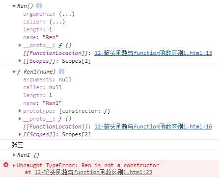

# 第一天 ECMAScript 6

## 今日内容

1. ES6 介绍
2. let 和 const 声明
3. 箭头函数

## 1. ECMA 介绍

> ECMAScript 6（简称ES6）是于2015年6月正式发布的 JavaScript 语言的标准，正式名为 ECMAScript 2015（ES2015）。它的目标是使得 JavaScript 语言可以用来编写复杂的大型应用程序，成为企业级开发语言。
>
> 另外，一些情况下 ES6 也泛指 ES2015 及之后的新增特性。

### 1.1 ECMA 组织与 ECMA-262

Ecma 国际（Ecma International）是一家国际性会员制度的信息和电信标准组织。1994年之前，名为欧洲计算机制造商协会（European Computer Manufacturers Association）。因为计算机的国际化，组织的标准牵涉到很多其他国家，因此组织决定改名表明其国际性。现名称已不属于首字母缩略字。

组织在1961年的日内瓦建立为了标准化欧洲的计算机系统。在欧洲制造、销售或开发计算机和电信系统的公司都可以申请成为会员。

Ecma 国际的任务包括与有关组织合作开发通信技术和消费电子标准、鼓励准确的标准落实、和标准文件与相关技术报告的出版。四十年来，Ecma 建立了很多信息和电信技术标准。组织出版了370标准和90技术报告，大约三分之二被国际标准化组织批准为国际标准。

Ecma 国际的标准，都会以 Ecma-Number 命名，ECMA-262 就是 ECMA 262 号标准，具体就是指 ECMAScript 遵照的标准。1996 年 11 月，网景公司将 JavaScript 提交给 Ecma 国际进行标准化。ECMA-262 的第一个版本于 1997 年 6 月被 Ecma 国际采纳。这一标准是在不断演进的，如现在是2020年6月发布的第11版。同样的，目前最为熟知的是2015年发布的 ES6。你还可以在 TC39的 ECMA262 官网上看到 ES2022 的最新草案。当然，ECMA 还维护着许多其他方面的标准，如：

（1）ECMA-414，定义了一组ES规范套件的标准。

（2）ECMA-404，定义了JSON数据交换的语法。

（3）甚至还有 120mm DVD 的标准：ECMA267。

从一个提案提出到最后纳入 ES 新特性，TC39 规定有如下五步：

（1）**stage0（strawman）：** 任何 TC39 的成员都可以提交。

（2）**stage1（proposal）：** 进入此阶段就意味着这一提案被认为是正式的了，需要对此提案的场景与 API 进行详尽的描述。

（3）**stage2（draft）：** 演进到这一阶段的提案如果能最终进入到标准，那么在之后的阶段都不会有太大的变化，因为理论上只接受增量修改。

（4）**state3（candidate）：** 这一阶段的提案只有在遇到了重大问题才会修改，规范文档需要被全面的完成。

（5）**state4（finished）：** 这一阶段的提案将会被纳入到 ES 每年发布的规范之中，只有到这个阶段的提案才会被标记为“已完成”，并在将来进入到下一个 ES 标准里。

由 ECMA-262 定义的 ECMAScript 与 web 服务器没有依赖关系。ECMA-262 定义的只是 ECMAScript 的语言基础。我们常见的 web 浏览器只是 ECMAScript 实现可能的宿主环境之一。宿主环境不仅提供基本的 ECMAScript 实现，同时也会提供该语言的扩展，以便语言与环境之间对接交互。

JavaScript 实现了 ECMAScript，尽管 ECMAScript 是一个重要的标准，但它并不是 JavaScript 唯一的部分，当然，也不是唯一被标准化的部分。实际上，一个完整的 JavaScript 实现是由以下 3 个不同部分组成的：

（1）核心（ECMAScript）。

（2）文档对象模型（DOM）。

（3）浏览器对象模型（BOM）。

### 1.2 ECMAScript 发展史

1996年11月，JavaScript 的创造者 Netscape 公司，决定将 JavaScript 提交给国际标准化组织 ECMA，希望这种语言能够成为国际标准。ECMA 是 European Computer Manufacturers Association 的缩写，即欧洲计算机制造商协会，ECMA 是制定信息传输与通讯的国际化标准组织。ECMA 的第 39 号技术专家委员会（Technical Committee 39，简称 TC39）负责制订 ECMAScript 标准，成员包括 Netscape、Sun、Microsoft、Mozilla、Google 等大公司。

1997年，ECMA 发布262号标准文件（ECMA-262）的第一版，规定了浏览器脚本语言的标准，并将这种语言称为 ECMAScript，这个版本就是1.0版。  该标准从一开始就是针对 JavaScript 语言制定的，但是之所以不叫 JavaScript，有两个原因。一是商标，Java 是 Sun 公司的商标，根据授权协议，只有 Netscape 公司可以合法地使用 JavaScript 这个名字，且 JavaScript 本身也已经被 Netscape 公司注册为商标。二是想体现这门语言的制定者是 ECMA，不是 Netscape，这样有利于保证这门语言的开放性和中立性。

因此，ECMAScript 和 JavaScript 的关系是，前者是后者的规格，后者是前者的一种实现。JScript 和 ActionScript 也算是 ECMAScript 的一种实现，ECMA 标准经历了一个漫长的发展历程：

1997年，ECMAScript 1.0发布。

1998年，ECMAScript 2.0发布。

1999年，ECMAScript 3.0发布。3.0版是一个巨大的成功，在业界得到广泛支持，成为通行标准，奠定了 JavaScript 语言的基本语法，以后的版本完全继承。直到今天，初学者一开始学习 JavaScript，其实就是在学3.0版的语法。

2000年，ECMAScript 4.0 开始酝酿。这个版本最后没有通过。为什么 ES4 没有通过呢？因为这个版本太激进了，对 ES3 做了彻底升级，导致标准委员会的一些成员不愿意接受。

2007年，ECMAScript 4.0版草案发布，本来预计次年8月发布正式版本。但是，各方对于是否通过这个标准，发生了严重分歧。以 Yahoo、Microsoft、Google 为首的大公司，反对 JavaScript 的大幅升级，主张小幅改动；以 JavaScript 创造者 Brendan Eich 为首的 Mozilla 公司，则坚持当前的草案。

2008年，由于对于4.0版本应该包括哪些功能，各方分歧太大，争论过于激烈，ECMA 开会决定，中止ECMAScript 4.0 的开发，将其中涉及现有功能改善的一小部分，发布为 ECMAScript 3.1（会后不久，ECMAScript 3.1 就改名为 ECMAScript 5），而将其他激进的设想扩大范围，放入以后的版本。由于会议的气氛，4.0版本的项目代号起名为 Harmony（和谐）。

2009年，ECMAScript 5.0 版正式发布。Harmony 项目则一分为二，一些较为可行的设想定名为JavaScript.next 继续开发，后来演变成 ECMAScript 6；一些不是很成熟的设想，则被视为 JavaScript.next.next，在更远的将来再考虑推出。

2011年，ECMAscript 5.1 版发布，并且成为 ISO 国际标准。

2013年3月，ECMAScript 6 草案冻结，不再添加新功能。

2013年12月，ECMAScript 6 草案发布。

2015年6月，ECMAScript 6 正式通过，成为国际标准。从2000年算起，这时已经过去了15年。

自此开始，ECMAScript 每年都会进行或大或小的版本更新，JavaScript 的语法也变得更加灵活。

## 2. 新的声明方式与作用域规则

> ES6 规则生效后，JavaScript 语法发生了翻天覆地的变化，新的语法规则提供了新颖的符号声明方式、更标准的面向对象语法以及更健壮的代码风格。本节内容将介绍 ES6 之后新的符号声明方式以及作用域关系。

### 2.1 新的声明符号 let

在过去的 JavaScript 代码中，只存在一种声明符号，那就是 var 符号。对 var 符号学习的过程中，了解到 var 声明的变量的特性如下：

（1）var 声明的变量存在声明提前，声明可被提前到当前作用域的顶点，var 符号所识别的作用域有全局的 script 作用域以及 function 作用域。

（2）var 声明的变量可以被重复声明，在过去的 JavaScript 语法中，可以通过使用闭包结构强制变量作用域降级，来防止同级别作用域中的变量污染。

（3）var 声明的变量在作用域链上遵循就近访问原则。

（4）var 声明的全局变量会自动绑定在 window 对象上。

#### 2.1.1 let 声明符号的新特性

let 声明符号的出现，从根本上解决了 var 声明符号作用域的问题，对于使用 let 声明的变量所属的作用域为当前的代码块，所以 let 的作用域与 var 完全不同，代码如下：

```html
<!DOCTYPE html>
<html lang="en">

<head>
    <meta charset="UTF-8">
    <meta http-equiv="X-UA-Compatible" content="IE=edge">
    <meta name="viewport" content="width=device-width, initial-scale=1.0">
    <title>Document</title>
</head>

<body>
    <script>
        if (true) {
            var a = 1
        }
        console.log(a) // 由于a会提升到if判断的范围外，所以可被全局访问，结果为1
        if (true) {
            let b = 2
            {
                console.log(b) //2
                let c = 3
                {
                    let b = 4
                    console.log(4, c) //2,3
                }
            }
        }
        console.log(b) // Error: b is not defined
    </script>
</body>

</html>
```

let 为块级声明符号，所以变量创建后只能在当前的作用域中被访问，let 识别所有作用域，任何一个大括号内都属于一个单独的作用域，不过 let 声明的变量也遵循就近访问原则。

let 声明的变量在同一个作用域内不可重复声明，所以 let 声明的变量可以有效的防止变量污染，无需闭包结构就可以将其局部化，且不存在声明提前，参考下列案例，代码如下：

```html
<!DOCTYPE html>
<html lang="en">

<head>
    <meta charset="UTF-8">
    <meta http-equiv="X-UA-Compatible" content="IE=edge">
    <meta name="viewport" content="width=device-width, initial-scale=1.0">
    <title>Document</title>
</head>

<body>
    <script>
        // console.log(a) //1. 打开此注释会报错：Cannot access 'a' before initialization
        let a = 123
        //同一个script作用域
        // let a = 456 //2. 打开此注释会报错：Identifier 'a' has already been declared 
        console.log(a);
    </script>
    <script>
        // console.log(window.a)//3. 值: undefined
        // console.log(a)//4. 值: 123
        //不同script作用域
        // let a = 456 //5. 打开此注释会报错：Identifier 'a' has already been declared 
    </script>
</body>

</html>
```

本案例中描述了两个重要的部分：

（1）let 声明的变量不可以在声明前被使用，相同作用域内，变量声明前的区域通常被称作该变量的暂时性死区，在暂时性死区中使用该变量会抛出异常信息：Cannot access 'xx' before initialization。

（2）let 声明的变量在同一作用域或同级别的 script 作用域均不可重复声明。

（3）let 声明的全局变量并不会绑定在全局的 window 对象上，它在当前 script 作用域后的作用域中，是通过作用域链直接访问的。

#### 2.1.2 let 常见的笔试题

let 声明符号及其特殊，所以其经常出现在面试题中，用于与 var 声明符号对比，这里比较典型的问题之一，就是 let 与 var 的作用域问题，代码如下：

```html
<!DOCTYPE html>
<html lang="en">

<head>
    <meta charset="UTF-8">
    <meta http-equiv="X-UA-Compatible" content="IE=edge">
    <meta name="viewport" content="width=device-width, initial-scale=1.0">
    <title>Document</title>
</head>

<body>
    <script>
        for (var i = 0; i < 5; i++) {
            setTimeout(function () {
                console.log(i)
            });
        }
        console.log(i)
        /*
            输出结果：
            5 -> 16行
            5 -> 14行
            5 -> 14行
            5 -> 14行
            5 -> 14行
            5 -> 14行
        */

        for (let j = 0; j < 5; j++) {
            setTimeout(function () {
                console.log(j)
            });
        }
        console.log(j)
        /*
            输出结果：
            j is not defined -> 33行
            0 -> 30行
            1 -> 30行
            2 -> 30行
            3 -> 30行
            4 -> 30行
        */
    </script>
</body>

</html>
```

运行案例会发现，相同的 for 循环案例，将声明符号从 var 改造成 let 后，会出现完全不同的运行结果，出现差别的原因是 let 与 var 的作用域不同。使用 var 声明循环中的变量时，i 变量被提升到全局作用域中，所以 for 循环在每次执行时，相当于不断的对全局的i变量进行赋值，直到 i 为 5 时跳出循环。由于 setTimeout() 为异步执行的定时器函数，所以 for 循环执行时计时器正在等待执行，接下来会执行 for 循环外对i的输出，便得到 i 为 5。当外部代码执行完毕时，setTimeout() 中的回调函数触发，此时只有一个全局变量 i 在当前代码块中可访问，且 i 已经变成 5，所以接下来的五次定时任务输出的内容也是 5。

当把 var 改成 let 后，其结果变为先抛出异常信息：“j is not defined”。然后在控制台中依次输出 0 到 4 数字。得到以下结果的原因很简单：let 声明的变量为块级变量，所以其所属作用域为 for 循环的大括号内，for 循环执行 5 次相当于在五个大括号内创建 5 个 j，代码如下：

```html
<!DOCTYPE html>
<html lang="en">

<head>
    <meta charset="UTF-8">
    <meta http-equiv="X-UA-Compatible" content="IE=edge">
    <meta name="viewport" content="width=device-width, initial-scale=1.0">
    <title>Document</title>
</head>

<body>
	<div class="col-1"></div>
	<script>
		
	</script>
    <script>

        {
            let j = 0
            setTimeout(function () {
                console.log(j)
            });
        }
        {
            let j = 1
            setTimeout(function () {
                console.log(j)
            });
        }
        {
            let j = 2
            setTimeout(function () {
                console.log(j)
            });
        }
        {
            let j = 3
            setTimeout(function () {
                console.log(j)
            });
        }
        {
            let j = 4
            setTimeout(function () {
                console.log(j)
            });
        }
        console.log(j)
        /*
            输出结果：
            j is not defined -> 33行
            0 -> 30行
            1 -> 30行
            2 -> 30行
            3 -> 30行
            4 -> 30行
        */
    </script>
</body>

</html>
```

五个作用域级别相同但相互独立，所以相当于每个作用域内都单独声明了一个局部变量 j，这样五个定时任务最终输出的结果为从 0 到 4，而 let 声明的变量只属于 for 循环体，所以循环外输出的 j，由于找不到任何名为 j 的变量，则会抛出异常信息。

除此案例外，面试场景中还会高频出现 let 的暂时性死区与 var 的声明提前问题，代码如下：

```html
<!DOCTYPE html>
<html lang="en">

<head>
    <meta charset="UTF-8">
    <meta http-equiv="X-UA-Compatible" content="IE=edge">
    <meta name="viewport" content="width=device-width, initial-scale=1.0">
    <title>Document</title>
</head>

<body>
    <script>
        // 问题1:声明提前问题
        var a = '张三'
        function test() {
            console.log(a) //undefined
            var a = '李四'
            console.log(a) //李四
        }
        test()
        console.log(a) //张三

        // 问题2:作用域问题
        var b = '张三1'
        function test1() {
            console.log(b) //张三1
            b = '李四1'
            console.log(b) //李四1
        }
        test1()
        console.log(b) //李四1

        // 问题3:暂时性死区问题
        let c = '张三2'
        function test2() {
            console.log(c)  //Cannot access 'c' before initialization
            let c = '李四2'
            console.log(c) //李四2
        }
        test2()
        console.log(c) //张三2
    </script>
</body>

</html>
```

本案例的考点围绕作用域与声明提前问题，问题 1 的结果为：undefined、李四、张三。第一个 a 的输出为 undefined，因为 test() 函数内部为函数作用域，虽然第一行就对 a 进行了输出，但程序运行时会隐式补充一个 var a 在当前作用域最上方，所以此时输出的 a 是函数内部声明但未赋值的a，则得到的结果为 undefined。后续的输出结果即按照变量所属作用域的不同，则值不同。

问题 2 的结果为：张三1、李四1、李四1。问题2所描述的场景是很容易被新手理解错的，该案例其实就是一个非常简单的全局变量操作场景，test1() 函数内部并未声明任何变量，所以所有 b 变量都是全局声明的b变量，则输出如上结果。

问题 3 的输出结果为：Cannot access 'c' before initialization。若将函数内第一行对c的输出注释掉后续代码才能正确运行。这是因为，虽然 test2() 函数的 c 在第一行输出切 c 是由 let 声明的，但此位置的 c 并不会访问全局的 c 变量。本质上由于 let 的规则问题，同名变量在当前的作用域中不可以在声明前被使用，这个规则就是为了防止当前案例场景出现。若不限制暂时性死区，该案例中的 test2() 函数内的第一行对 c 的输出会访问到全局的 c 变量，而后面对 c 的输出则会访问 test2() 内声明的局部变量 c。这样便会出现同一个作用域内，同一个变量既代表全局变量又代表局部变量，这在逻辑上是非常不合理的。

### 2.2 新的声明符号 const

与let声明符号类似，ES6 的新规范中提到了新的声明符号 const，该声明符号意在解决 JavaScript 编程场景中的常量声明场景。

#### 2.2.1 const 声明符号的新特性

学习过其他编程语言的同学应该了解，某些编程语言在声明变量时存在终态的概念，比如在 Java 语言中，使用 final 修饰的变量为不可改变量，声明后将永远保持声明时设置的结果。const 符号意在为 JavaScript 提供 final 的变量，在程序开发过程中，若需要对公司内部的某邮箱发送程序的告警信息，以便收集程序运行的日志，则可能会在程序中声明邮箱地址以及验证信息等变量，代码如下：

```html
<!DOCTYPE html>
<html lang="en">

<head>
    <meta charset="UTF-8">
    <meta http-equiv="X-UA-Compatible" content="IE=edge">
    <meta name="viewport" content="width=device-width, initial-scale=1.0">
    <title>Document</title>
</head>

<body>
    <script>
        //收集日志的邮箱地址
        var email = 'xxx@xxx.com'
        var token = 'xxxxx'
        //模拟日志收集函数
        function send(email, token) {
            //发送逻辑
        }
        //需要发送信息时调用send()函数
        send(email, token)
    </script>
</body>

</html>
```

当前案例若使用 var 或 let 进行变量声明，都可能会带来风险问题。无论使用 var 还是 let 创建 email，该变量都作为当前 script 作用域的全局变量存在，若使用 var 声明，很可能在后续代码中被其他同名变量覆盖。若使用 let 声明，虽然重复声明会抛出异常信息，若某个开发者在后续的代码中未声明，直接对全局的 email 属性进行了重写，则 send() 函数发送的数据就会丢失。

const 声明符号就是为了解决上述问题而出现的。在开发过程中，通常会存在一些类似如上案例中 email 变量的变量，这些变量在初始化后便不再需要重写并不希望被其他开发者修改，这样的变量通常被称为常量。常量在软件开发领域中使用广泛，相当于只读变量，在 JavaScript 使用 const 声明符号创建的变量都认为是常量。上文的案例可以使用 const 进行修改，代码如下：

```html
<!DOCTYPE html>
<html lang="en">

<head>
    <meta charset="UTF-8">
    <meta http-equiv="X-UA-Compatible" content="IE=edge">
    <meta name="viewport" content="width=device-width, initial-scale=1.0">
    <title>Document</title>
</head>

<body>
    <script>
        //收集日志的邮箱地址
        const email = 'xxx@xxx.com'
        const token = 'xxxxx'
        //模拟日志收集函数
        function send(email, token) {
            //发送逻辑
        }
        //需要发送信息时调用send()函数
        send(email, token)
        email = '你好' //Assignment to constant variable
    </script>
</body>

</html>
```

若使用 const 声明该变量，则后续的编程中，该变量表现为只读变量，任何对变量的重新赋值都会触发代码异常。

#### 2.2.2 const 使用时的注意事项

与 let 声明符号相同，const 声明的变量在作用域等表现与let完全相同。除此之外，const 还具备自身的一些特性：

（1）const 声明的变量为只读变量，不可以对该变量进行重新赋值，否则程序会抛出异常信息。

（2）由于const 声明的变量代表常量，所以 const 声明的变量必须初始化，即声明时赋值，否则其会失去常量的意义。

const 自身特性的案例，代码如下：

```html
<!DOCTYPE html>
<html lang="en">

<head>
    <meta charset="UTF-8">
    <meta http-equiv="X-UA-Compatible" content="IE=edge">
    <meta name="viewport" content="width=device-width, initial-scale=1.0">
    <title>Document</title>
</head>

<body>
    <script>
        // const a //Error:Missing initializer in const declaration
        const b = 1
        b = 2 //Error:Assignment to constant variable
    </script>
</body>

</html>
```

const 声明符号在使用时还存在极特殊场景，该情况也经常出现在公司面试题中。当 const 声明的变量为基本类型数据时，其只读变量的特征显现无遗。若 const 声明的变量为引用类型时，其操作会产生歧义，代码如下：

```html
<!DOCTYPE html>
<html lang="en">

<head>
    <meta charset="UTF-8">
    <meta http-equiv="X-UA-Compatible" content="IE=edge">
    <meta name="viewport" content="width=device-width, initial-scale=1.0">
    <title>Document</title>
</head>

<body>
    <script>
        const arr = [1, 2, 3]
        arr[0] = 4
        console.log(arr)//[4,2,3]
        const obj = { name: '张三' }
        obj.name = '李四'
        console.log(obj) // { name:'李四' }

        arr = [0, 0, 0] //Error:Assignment to constant variable
        obj = {} //Error:Assignment to constant variable
    </script>
</body>

</html>
```

该案例中的变量均有 const 声明，但数组与对象对内部属性的操作均不会使程序运行异常，出现该现象的原因是，引用类型的变量中保存的是引用数据的内存地址，所以无论数组还是对象，只要使用下标或键来操作对象内部的属性时，变量中保存的内存地址并未发生变化，所以不违反 const 声明符号的规则。直到重新对变量赋值时，才会触发 const 声明符号的异常信息。

## 3. 箭头函数与普通函数

>在传统的JavaScript开发中，创建一个函数通常使用funciton来实现。ES6标准后，JavaScript语法中出现了一种新的函数那就是箭头函数。

### 3.1 箭头函数介绍

箭头函数表达式的语法比函数表达式更简洁，<!--并且没有自己的--> this，arguments，super 或 new.target。箭头函数表达式更适用于那些本来需要匿名函数的地方，并且它不能用作构造函数。

ES6 推出箭头函数的初衷很简单，ES5 时代的 JavaScript 语法中 function 既可以表示函数，又可以表示对象；既可以使用 new 关键字进行实例化，又可以通过函数调用的方式完成封装好的功能调用。所以 ES6 规范中规定箭头函数为单纯的函数特征，不可以通过 new 进行实例化，且新规范中对 JavaScript 的变相对象编程引入了class 的结构（后面的章节详细介绍），这使得 JavaScript 成为了完全的面向对象编程语言。

#### 3.1.1 箭头函数的声明方式

与 function 函数不同，箭头函数不可以显示声明，代码如下：

```html
<!DOCTYPE html>
<html lang="en">

<head>
    <meta charset="UTF-8">
    <meta http-equiv="X-UA-Compatible" content="IE=edge">
    <meta name="viewport" content="width=device-width, initial-scale=1.0">
    <title>Document</title>
</head>

<body>
    <script>
        // 回顾function的显示声明方式
        function test(arg1, arg2) {
            return arg1 + arg2
        }
        //函数调用
        let sum = test(1, 2)
        console.log(sum)//3
        // 回顾funciton函数的匿名创建方式
        let test1 = function (arg) {
            console.log(arg)//111
        }
        test1(111)

        // 箭头函数的结构
        let test2 = (arg1, arg2) => {
            return arg1 + arg2
        }
        let sum2 = test2(3, 4)
        console.log(sum2)//7
    </script>
</body>

</html>
```

箭头函数的声明方式更加简洁，不再需要显示声明 function，参数与返回值的结构不变。不同于 funciton 函数，箭头函数不可以显示声明，它的函数体必需匿名存在。

#### 3.1.2 箭头函数的简洁使用

箭头函数除基本使用方式外，还存在更加简洁的使用方式，代码如下：

```html
<!DOCTYPE html>
<html lang="en">

<head>
    <meta charset="UTF-8">
    <meta http-equiv="X-UA-Compatible" content="IE=edge">
    <meta name="viewport" content="width=device-width, initial-scale=1.0">
    <title>Document</title>
</head>

<body>
    <script>
        //不编写大括号时箭头右侧的表达式即箭头函数的返回值
        /*
            相当于
            let test = (arg1,arg2) => {
                return arg1+arg2
            }
        */
        let test = (arg1, arg2) => arg1 + arg2
        let sum = test(1, 2)
        console.log(sum)

        //当箭头函数的参数有且只有一个时，可省略小括号
        /*
            相当于
            let toBoolean = (val) => {
                //!!val相当于强制将变量转换成其对应的truthy或falsy值
                return !!val
            }
        */
        let toBoolean = val => !!val
        let a = toBoolean(1)
        console.log(a) // true
        let b = toBoolean(0)
        console.log(b) // false
    </script>
</body>

</html>
```

### 3.2 箭头函数与 function 函数的区别

箭头函数除格式外，还存在很多与 function 函数上的本质区别，这些区别也会使箭头函数与普通函数，在相同的代码结构中运行时，产生不同的运行结果。

#### 3.2.1 箭头函数无法通过 new 关键字进行实例化

在 JavaScript 面向对象的章节中了解到，function 函数可以作为类存在，通过 new 关键字实例化，可以将一个 funciton 的功能抽象封装，并分发给不同的对象复用。ES6 中推出的箭头函数意在将函数功能单纯化，所以箭头函数与 function 函数的本质区别，在于箭头函数并不具备任何面向对象编程特性，代码如下：

```html
<!DOCTYPE html>
<html lang="en">

<head>
    <meta charset="UTF-8">
    <meta http-equiv="X-UA-Compatible" content="IE=edge">
    <meta name="viewport" content="width=device-width, initial-scale=1.0">
    <title>Document</title>
</head>

<body>
    <script>
        let Ren = (name) => {
            console.log(name)
        }
        let Ren1 = function (name) {
            console.log(name)
        }
        console.dir(Ren)
        console.dir(Ren1)
        let r1 = new Ren1('张三')
        console.log(r1)
        let r = new Ren('李四')
        console.log(r) //Error:Ren is not a constructor

    </script>
</body>

</html>
```

运行此案例会发现代码最后会抛出异常信息：Ren is not a constructor。这对应的是 new Ren(‘李四’) 这一行代码，在使用 new 关键字实例化箭头函数失败的原因，根据案例的输出结果便可以得知，如图 3-1 所示。



<center><b>图 3-1 案例的输出结果的效果图</b></center>

根据图 3-1 可以看出，在使用 console.dir() 输出两个函数体时，funciton 函数对象在名称前存在 f 标识，并且在 Ren1 对象本身存在 prototype 原型对象，且原型对象中存在 contructor() 函数。new 关键字在实例化函数对象的过程时，会优先找到对象原型上的 contructor() 函数并调用它，随后继续执行实例化的完整流程，由于箭头函数存在原型对象且无 contructor() 函数，所以箭头函数在做 new 关键字实例化时，第一步就会由于找不到 contructor() 而抛出异常。

#### 3.2.2 this 指向的不同

箭头函数在作为普通函数被使用时，除基结构与 function 函数不同外，函数内部的 this 指向仍然有很大差异，参考下面的案例，代码如下：

```html
<!DOCTYPE html>
<html lang="en">

<head>
    <meta charset="UTF-8">
    <meta http-equiv="X-UA-Compatible" content="IE=edge">
    <meta name="viewport" content="width=device-width, initial-scale=1.0">
    <title>Document</title>
</head>

<body>
    <script>
        function test() {
            console.log(this)
        }
        test()//window
        test.apply([])//[]

        let test1 = () => {
            console.log(this)
        }
        //箭头函数内部的this无法被call()、bind()以及apply()改变
        test1()//window
        test1.apply([])//window

        let obj = {
            //fn(){}相当于fn:function(){}
            fn() {
                //obj.fn()时结果为obj{}
                //fn()时结果为window
                console.log(this)
                let test2 = () => {
                    //obj.fn()时结果为obj{}
                    //fn()时结果为window
                    console.log(this)
                }
                test2()
                function test3() {
                    //结果恒为window
                    console.log(this)
                }
                test3()
            },
            fn1: () => {
                //结果恒为window
                console.log(this)
            }
        }
        //此时相当于fn的调用者为obj对象本身
        obj.fn()
        let fn = obj.fn
        //此时相当于fn的调用者为window
        fn()

        //此时相当于fn1的调用者为obj对象本身
        obj.fn1()
        let fn1 = obj.fn1
        //此时相当于fn1的调用者为window
        fn1()
    </script>
</body>

</html>
```

运行案例后会发现，箭头函数内部的 this 对象与 function 函数内部的this对象，在代码执行过程中的表现差异极大，可以总结如下规则：

（1）function 函数内部的 this 对象随函数调用对象变化，若无对象引用该函数体，则调用时 this 为 window，所以 function 函数中的 this 对象是变化的。

（2）箭头函数内部的 this 并不会随该函数的调用对象变化，箭头函数体中的 this 对象在执行时是恒定的，其具体内容取决于函数体编写的作用域，函数体所属作用域中的 this 指向，就是箭头函数内部的 this 指向，所以箭头函数中的 this 在函数编写后便是恒定不变的。

（3）function 函数可以通过 bind()、apply() 以及 bind() 来改变函数调用时的 this 指向，而箭头函数中的 this 对象不具备该功能，这更加体现了箭头函数体的 this 指向是恒定的。

#### 3.2.3 参数对象的区别

传统的 function 函数内部可以使用 arguments，来动态的获取函数调用时，传递的形式参数，arguments 是一个具备数组结构特性但没有继承 Array 的伪数组。箭头函数在调用过程中，函数体中不可以使用 arguments 进行动态的参数获取，接下来参考下面的案例，代码如下：

```html
<!DOCTYPE html>
<html lang="en">

<head>
    <meta charset="UTF-8">
    <meta http-equiv="X-UA-Compatible" content="IE=edge">
    <meta name="viewport" content="width=device-width, initial-scale=1.0">
    <title>Document</title>
</head>

<body>
    <script>
        function test() {
            let a = arguments[0]
            let b = arguments[1]
            let c = arguments[2]
            console.log(a, b, c)
            console.log(arguments instanceof Array)//false
        }
        test(1, 2)//1,2,undefined
        test(1, 2, 3)//1,2,3
        let test1 = (...args) => {
            // console.log(arguments) //打开注释后抛出异常：arguments is not defined
            console.log(args)//数组对象
            console.log(args instanceof Array)//true
            args.forEach(item => {
                console.log(item)
            })
        }
        test1(1, 2, 3)
        /*
            1
            2
            3
        */
    </script>
</body>

</html>
```

看案例代码会发现，arguments 对象在箭头函数体无法使用，但可以通过在箭头函数的形式参数括号中使用(…变量)的格式，获取函数调用时传入的参数。与 arguments 不同，箭头函数动态获取的参数对象是 Array，所以其可以使用 Array 的原型上所有方法。

## 4. 解构赋值

### 4.1 数组的解构赋值

解构赋值语法是一种 Javascript 表达式。通过解构赋值，可以将属性/值从对象/数组中取出，赋值给其他变量。

对象和数组逐个对应表达式，或称对象字面量和数组字面量，提供了一种简单的定义一个特定的数据组的方法，代码如下: 

```javascript
var x = [1, 2, 3, 4, 5];
```

解构赋值使用了相同的语法，不同的是在表达式左边定义了要从原变量中取出什么变量，代码如下：

```javascript
var x = [1, 2, 3, 4, 5];
//左侧的数组结构会按顺序从x中获取对应下标的值
var [y, z] = x;
console.log(y); // 1
console.log(z); // 2
```

JavaScript 中，解构赋值的作用类似于 Perl 和 Python 语言中的相似特性。变量声明并赋值时的解构，代码如下：

```javascript
var foo = ["one", "two", "three"];
var [one, two, three] = foo;
console.log(one); // "one"
console.log(two); // "two"
console.log(three); // "three"
```

变量先声明后赋值时的解构，通过解构分离变量的声明，可以为一个变量赋值，代码如下：

```javascript
var a, b;

[a, b] = [1, 2];
console.log(a); // 1
console.log(b); // 2
```

为了防止从数组中取出一个值为undefined的对象，可以在表达式左边的数组中为任意对象预设默认值，代码如下：

```javascript
var a, b;

[a=5, b=7] = [1];
console.log(a); // 1
console.log(b); // 7
```

没有解构赋值的情况下，交换两个变量需要一个临时变量（或者用低级语言中的XOR-swap 技巧），在一个解构表达式中可以交换两个变量的值，代码如下: 

```javascript
var a = 1;
var b = 3;

[a, b] = [b, a];
console.log(a); // 3
console.log(b); // 1
```

从一个函数返回一个数组是十分常见的情况，解构使得处理返回值为数组时更加方便。在下面例子中，要让 [1, 2] 成为函数的 f() 的输出值，可以使用解构在一行内完成解析，代码如下：

```javascript
function f() {
  return [1, 2];
}

var a, b;
[a, b] = f();
console.log(a); // 1
console.log(b); // 2
```

解构赋值，可以忽略不感兴趣的返回值，代码如下：

```javascript
function f() {
    return [1, 2, 3];
}

var [a, , b] = f();
console.log(a); // 1
console.log(b); // 3
```

也可以忽略全部返回值，代码如下：

```javascript
[,,] = f();
```

当解构一个数组时，可以使用剩余模式，将数组剩余部分赋值给一个变量，代码如下：

```javascript
var [a, ...b] = [1, 2, 3];
console.log(a); // 1
console.log(b); // [2, 3]
```

如果剩余元素右侧有逗号，会抛出 SyntaxError，因为剩余元素必须是数组的最后一个元素，代码如下：

```javascript
var [a, ...b,] = [1, 2, 3];
// SyntaxError: rest element may not have a trailing comma
```

### 4.2 对象的解构赋值

对象的基本结构方式，代码如下：

```javascript
var o = { p: 42, q: true };
var { p, q } = o;

console.log(p); // 42
console.log(q); // true
```

一个变量可以独立于其声明进行解构赋值，代码如下：

```javascript
var a, b;
({a, b} = {a: 1, b: 2});
```

需要注意的是，赋值语句周围的圆括号 ( ... ) ，在使用对象字面量无声明解构赋值时，是必须的。{a, b} = {a: 1, b: 2} 不是有效的独立语法，因为左边的 {a, b} 被认为是一个块而不是对象字面量。然而，({a, b} = {a: 1, b: 2}) 是有效的，正如 var {a, b} = {a: 1, b: 2}，表达式之前需要有一个分号，否则它可能会被当成上一行中的函数执行。

可以从一个对象中提取变量并赋值给和对象属性名不同的新的变量名，代码如下：

```javascript
var o = {p: 42, q: true};
var {p: foo, q: bar} = o;

console.log(foo); // 42
console.log(bar); // true
```

变量可以先赋予默认值。当要提取的对象对应属性解析为 undefined，变量就被赋予默认值，代码如下：

```javascript
var {a = 10, b = 5} = {a: 3};
console.log(a); // 3
console.log(b); // 5
```

一个属性可以同时从一个对象解构，并分配给一个不同名称的变量。 还可以分配一个默认值，以防未解构的值是 undefined，代码如下：

```javascript
var {a:aa = 10, b:bb = 5} = {a: 3};
console.log(aa); // 3 存在a属性所以aa为3
console.log(bb); // 5 不存在b属性所以bb为5
```

在函数中解构参数时，ES6的与ES5的代码结构完全不同，代码如下：

```javascript
//ES5 版本
function drawES5Chart(options) {
    options = options === undefined ? {} : options;
    var size = options.size === undefined ? 'big' : options.size;
    var cords = options.cords === undefined ? { x: 0, y: 0 } : options.cords;
    var radius = options.radius === undefined ? 25 : options.radius;
    console.log(size, cords, radius);
    // now finally do some chart drawing
}

drawES5Chart({
    cords: { x: 18, y: 30 },
    radius: 30
});

//ES6 版本
function drawES6Chart({ size = 'big', cords = { x: 0, y: 0 }, radius = 25 } = {}) {
	console.log(size, cords, radius);
	// do some chart drawing
}

drawES6Chart({
	cords: { x: 18, y: 30 },
	radius: 30
});
```

需要注意的是，在上面的 drawES6Chart() 的函数签名中，解构的左手边被分配给右手边的空对象字面值：{size = 'big', cords = {x: 0, y: 0}, radius = 25} = {}。你也可以在没有右侧分配的情况下编写函数。但是，如果忽略了右边的赋值，那么函数会在被调用的时候查找至少一个被提供的参数，而在当前的形式下，可以直接调用 drawES6Chart() 而不提供任何参数。如果希望在不提供任何参数的情况下调用该函数，则当前的设计非常有用，而另一种方法在确保将对象传递给函数时非常有用。

接下来，参考解构嵌套对象和数组的案例，代码如下：

```javascript
const metadata = {
    title: 'Scratchpad',
    translations: [
        {
            locale: 'de',
            localization_tags: [],
            last_edit: '2014-04-14T08:43:37',
            url: '/de/docs/Tools/Scratchpad',
            title: 'JavaScript-Umgebung'
        }
    ],
    url: '/en-US/docs/Tools/Scratchpad'
};

let {
    title: englishTitle, // rename
    translations: [
        {
            title: localeTitle, // rename
        },
    ],
} = metadata;

console.log(englishTitle); // "Scratchpad"
console.log(localeTitle);  // "JavaScript-Umgebung"
```

另外，还可以将要解构的key作为变量使用，代码如下：

```javascript
let key = "z";
let { [key]: foo } = { z: "bar" };
console.log(foo); // "bar"
```

rest 属性收集那些尚未被解构模式拾取的剩余可枚举属性键，代码如下：

```javascript
let {a, b, ...rest} = {a: 10, b: 20, c: 30, d: 40}
a; // 10
b; // 20
rest; // { c: 30, d: 40 }
```

通过提供有效的替代标识符，解构可以与不是有效的 JavaScript标识符的属性名称一起使用，代码如下：

```javascript
const foo = { 'fizz-buzz': true };
const { 'fizz-buzz': fizzBuzz } = foo;
console.log(fizzBuzz); // true
```

解构对象时会查找原型链（如果属性不在对象自身，将从原型链中查找），代码如下：

```javascript
// 声明对象 和 自身 self 属性
var obj = {self: '123'};
// 在原型链中定义一个属性 prot
obj.__proto__.prot = '456';
// test
const {self, prot} = obj;
// self "123"
// prot "456"（访问到了原型链）
```

## 5. 模板字符串

在ES5编程规则中，字符串类型的数据需要被单引号或双引号包裹，代码如下：

```javascript
let str = '123'
let str1 = "456"
```

模板字面量是允许嵌入表达式的字符串字面量。你可以使用多行字符串和字符串插值功能。它们在 ES2015 规范的先前版本中被称为“模板字符串”。模版字符串的基础语法，代码如下：

```javascript
`string text`

`string text line 1
 string text line 2`

`string text ${expression} string text`

tag `string text ${expression} string text`
```

模板字符串使用反引号 (\`\`) 来代替普通字符串中的用双引号和单引号。模板字符串可以包含特定语法（${expression}）的占位符。占位符中的表达式和周围的文本会一起传递给一个默认函数，该函数负责将所有的部分连接起来，如果一个模板字符串由表达式开头，则该字符串被称为带标签的模板字符串，该表达式通常是一个函数，它会在模板字符串处理后被调用，在输出最终结果前，你都可以通过该函数来对模板字符串进行操作处理。在模版字符串内使用反引号（\`）时，需要在它前面加转义符（\），代码如下：

```javascript
`\`` === "`" // --> true
```

#### 5.1 多行字符串

在新行中插入的任何字符都是模板字符串中的一部分，使用普通字符串，可以通过以下的方式获得多行字符串，代码如下：

```javascript
console.log('string text line 1\n' +
'string text line 2');
// "string text line 1
// string text line 2"
```

要获得同样效果的多行字符串，只需参考下面的案例，代码如下：

```javascript
console.log(`string text line 1
string text line 2`);
// "string text line 1
// string text line 2"
```

#### 5.2 插入表达式

在普通字符串中嵌入表达式，必须使用如下语法，代码如下：

```javascript
var a = 5;
var b = 10;
console.log('Fifteen is ' + (a + b) + ' and\nnot ' + (2 * a + b) + '.');
// "Fifteen is 15 and
// not 20."
```

#### 5.3 嵌套模版

在某些时候，嵌套模板是具有可配置字符串的最简单也是更可读的方法。在模板中，只需在模板内的占位符 ${ } 内使用它们，就可以轻松地使用内部反引号。例如，如果条件 a 是真的，那么返回这个模板化的文字。

在ES5中需要使用下文案例的方式编写代码，代码如下：

```javascript
var classes = 'header'
classes += (isLargeScreen() ?
        '' : item.isCollapsed ?
        ' icon-expander' : ' icon-collapser');
```

在 ES6 中使用模板文字而没有嵌套，代码如下：

```javascript
const classes = `header ${isLargeScreen() ? '' : 
	(item.isCollapsed ? 'icon-expander' : 'icon-collapser')}`;
```

在 ES6 的嵌套模板字面量中，代码如下：

```javascript
const classes = `header ${isLargeScreen() ? '' : 
	`icon-${item.isCollapsed ? 'expander' : 'collapser'}`}`;
```

#### 5.4 带标签的模板字符串

更高级的形式的模板字符串是带标签的模板字符串。标签使得可以用函数解析模板字符串，标签函数的第一个参数包含一个字符串值的数组，其余的参数与表达式相关。最后，函数可以返回处理好的的字符串（或者它可以返回完全不同的东西 ）。用于该标签的函数的名称可以被命名为任何名字。

接下来，参考下面的案例，进一步理解带标签的模板字符串，代码如下：

```javascript
let person = 'Mike';
let age = 28;

function myTag(strings, personExp, ageExp, demo) {
    let str0 = strings[0]; // "That "
    let str1 = strings[1]; // " is a "
    let str2 = strings[2]; // "."
    let str3 = strings[3];
    console.log(strings);
    let ageStr;
    if (ageExp > 99) {
        ageStr = 'centenarian';
    } else {
        ageStr = 'youngster';
    }

    // We can even return a string built using a template literal
    // 模板 变量分割字符串
    return `${str0}${personExp}${str1}${ageStr}${str2}`;
}

let output = myTag`That ${person} is a ${age}. 哈哈`;

console.log(output);
// That Mike is a youngster.
```

#### 5.5 原始字符串

在标签函数的第一个参数中，存在一个特殊的属性raw ，可以通过它来访问模板字符串的原始字符串，而不经过特殊字符的替换，代码如下：

```javascript
function tag(strings) {
  console.log(strings.raw[0]);
}

tag`string text line 1 \n string text line 2`;
// logs "string text line 1 \n string text line 2" ,
// including the two characters '\' and 'n'
```

另外，使用String.raw() 方法创建原始字符串，与使用默认模板函数和字符串连接创建是一样的，代码如下：

```javascript
let str = String.raw`Hi\n${2+3}!`;
// "Hi\\n5!"

str.length;.
// 6

str.split('').join(',');.
// "H,i,\\,n,5,!"
```

#### 5.6 带标签的模板字面量及转义序列

自 ES2016 起，带标签的模版字面量遵守以下转义序列的规则：

（1）Unicode 字符以"\u"开头，例如\u00A9。

（2）Unicode 码位用"\u{}"表示，例如\u{2F804}。

（3）十六进制以"\x"开头，例如\xA9。

（4）八进制以"\"和数字开头，例如\251。

这表示类似下面这种带标签的模版是有问题的，因为对于每一个 ECMAScript 语法，解析器都会去查找有效的转义序列，但是只能得到这是一个形式错误的语法，代码如下：

```javascript
latex`\unicode`
// 在较老的 ECMAScript 版本中报错（ES2016 及更早）
// SyntaxError: malformed Unicode character escape sequence
```

#### 5.7 ES2018关于非法转义序列的修订

带标签的模版字符串应该允许嵌套支持常见转义序列的语言（例如DSLs、LaTeX）。ECMAScript 提议模版字面量修订(第 4 阶段，将要集成到 ECMAScript 2018 标准) 移除对 ECMAScript 在带标签的模版字符串中转义序列的语法限制。

不过，非法转义序列在"cooked"当中仍然会体现出来。它们将以 undefined 元素的形式存在于"cooked"之中，代码如下：

```javascript
function latex(str) {
 return { "cooked": str[0], "raw": str.raw[0] }
}

latex`\unicode`

// { cooked: undefined, raw: "\\unicode" }
```

值得注意的是，这一转义序列限制只对带标签的模板字面量移除，而不包括不带标签的模板字面量，代码如下：

```javascript
let bad = `bad escape sequence: \unicode`;
```

