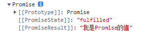

# 第三天 ECMAScript 6

## 今日内容

## 1. Promise 对象

> Promise是ES6版本提案中实现的异步处理方式，对象代表了未来将要发生的事件，用来传递异步操作的消息。

### 1.1 Promise 对象简介

JavaScript是一门典型的异步编程脚本语言，在编程过程中会大量出现异步代码，在JavaScript的整个发展历程中，对异步编程的处理方式经历了很多个时代，其中最典型也是现今使用最广泛的时代，便是Promise对象处理异步编程的时代。

### 1.2 为什么使用Promise对象

在过去的编程中，JavaScript的主要异步处理方式，是采用回调函数的方式来进行处理，想要保证多个步骤的异步编程有序进行，会出现下列情况，代码如下：

```html
<!DOCTYPE html>
<html lang="en">

<head>
    <meta charset="UTF-8">
    <meta http-equiv="X-UA-Compatible" content="IE=edge">
    <meta name="viewport" content="width=device-width, initial-scale=1.0">
    <title>Document</title>
</head>

<body>
    <script>
        setTimeout(function () {
            //第一秒后执行的逻辑
            console.log('第一秒之后发生的事情')
            setTimeout(function () {
                //第二秒后执行的逻辑
                console.log('第二秒之后发生的事情')
                setTimeout(function () {
                    //第三秒后执行的逻辑
                    console.log('第三秒之后发生的事情')
                }, 1000)
            }, 1000)
        }, 1000)
    </script>
</body>

</html>
```


如案例中描述，若每间隔1秒运行1个任务，这3个任务必须按时间顺序执行，且每下一秒执行前，都要先拿到上一秒运行的结果，则不得不将代码编写为以上案例中的结构。该写法主要为保证代码的执行顺序，这样则避免不了在回调函数中嵌套大量的逻辑代码，这也是人们常说的“回调地狱”。

在实际编程中，上述案例使用场景极少。在前端开发过程中，使用较多的异步流程为AJAX请求结构。当要求某个页面的多个接口保证有序调用时，开发者可能会采用嵌套结构实现，代码如下：

```javascript
//获取类型数据
$.ajax({
    url: '/***',
    success: function (res) {
        var xxId = res.id
        //获取该类型的数据集合，必须等待回调执行才能进行下一步
        $.ajax({
            url: '/***',
            data: {
                xxId: xxId,//使用上一个请求结果作为参数调用下一个接口
            },
            success: function (res1) {
                //得到指定类型集合
                ...

            }
    	})
    }
})
```

这种情况在很多开发者的代码中都出现过。如果流程复杂化，在网络请求中继续夹杂其它异步流程，这样的代码会变得难以维护。

其它异步场景，诸如Node.js中的原始fs模块等异步流程，在复杂业务场景中都避免不了这种嵌套结构。ECMA提案中之所以出现Promise解决方案，便是为解决JavaScript在开发过程中遇到的实际问题：“回调地狱”。其实解决回调地狱还其它方案，本节不介绍中间的过渡方案，以Promise流程控制对象为主，因为他是解决回调地狱的方法。

### 1.3 使用Promise解决回调地狱

上面内容仅抛出问题，并没有针对问题作出合理的回答。接下来阐述如何使用Promise对象解决回调地狱问题。

在阐述前，先对Promise做一个简单的介绍：Promise对象以链式调用的结构，将原本回调嵌套的异步处理流程，转化成“对象.then().then()...”的链式结构，虽然这种结构仍离不开回调函数，但将原本的回调嵌套结构，转化成连续调用结构，这样便可以采用“从上到下、从左至右”的方式进行阅读。

接下来仍然以setTimeout()场景为例，改造上面的异步案例，代码如下：

```html
<!DOCTYPE html>
<html lang="en">

<head>
    <meta charset="UTF-8">
    <meta http-equiv="X-UA-Compatible" content="IE=edge">
    <meta name="viewport" content="width=device-width, initial-scale=1.0">
    <title>Document</title>
</head>

<body>
    <script>
        //使用Promise拆解的setTimeout流程控制
          
        var p = new Promise(function (resolve) {
            setTimeout(function () {
                resolve()
            }, 1000)
        })
        p.then(function () {
            //第一秒后执行的逻辑
            console.log('第一秒之后发生的事情')
            return new Promise(function (resolve) {
                setTimeout(function () {
                    resolve()
                }, 1000)
            })
        }).then(function () {
            //第二秒后执行的逻辑
            console.log('第二秒之后发生的事情')
            return new Promise(function (resolve) {
                setTimeout(function () {
                    resolve()
                }, 1000)
            })
        }).then(function () {
            //第三秒后执行的逻辑
            console.log('第三秒之后发生的事情')
        })
    </script>
</body>

</html>
```

阅读案例会发现，使用Promise后的代码，将原来的3个setTimeout()的回调嵌套，拆解成了3个then()包裹的回调函数，按照上下顺序进行编写。这样从视觉上便可以按照人类“从上到下、从左到右”的线性思维来阅读代码，直观的查看这段代码的执行流程，其代价增加了接近1倍的代码量。

从以上案例得知，Promise的作用是解决“回调地狱”，它的解决方式是将回调嵌套拆成链式调用，这样便可以按照上下顺序来，进行异步代码的流程控制。

### 1.4 回调函数与Promise对象

Promise对象是一个JavaScript对象，在支持ES6语法的运行环境中，自动出现在全局对象中，他的初始化方式，代码如下：

```javascript
//fn:是初始化过程中调用的函数他是同步的回调函数
var p = new Promise(fn)
```

#### 1.4.1 重新理解回调函数

这里涉及到一个概念：JavaScript语言中，有一个特殊的函数叫做回调函数。回调函数的特点，是把函数作为变量看待，由于JavaScript变量可以作为函数的形参，且函数可以匿名创建。所以在定义函数时，可将一个函数的参数当作另一个函数来执行，代码如下：

```javascript
//把fn当作函数对象那么就可以在test函数中使用()执行他
function test(fn){
  fn()
}
//那么运行test的时候fn也会随着执行，所以test()中传入的匿名函数会运行
test(function(){
  ...
})
```

案例中的结构为JavaScript中典型的回调函数结构。按照事件循环中介绍的JavaScript函数运行机制，会发现其实回调函数本是同步代码，这是一个需要重点理解的知识点。

通常在编写JavaScript代码时，使用的回调嵌套的形式大多是异步流程，所以一些开发者可能会下意识认为，凡是回调形式的函数都是异步流程。其实并不是这样的，真正的解释是：JavaScript中的回调函数结构，默认是同步的结构，由于JavaScript单线程异步模型的规则，想要编写异步代码，必须使用回调嵌套的形式才能实现，所以回调函数结构不一定是异步流程，但是异步流程一定靠回调函数结构实现。

接下来通过一个简单的案例，理解回调函数与同步异步的关系，代码如下：

```html
<!DOCTYPE html>
<html lang="en">

<head>
    <meta charset="UTF-8">
    <meta http-equiv="X-UA-Compatible" content="IE=edge">
    <meta name="viewport" content="width=device-width, initial-scale=1.0">
    <title>Document</title>
</head>

<body>
    <script>
        //同步的回调函数案例
        function test(fn) {
            fn()
        }
        console.log(1)
        test(function () {
            console.log(2)
        })
        console.log(3)
        //这段代码的输出顺序应该是1、2、3，因为他属于直接进入执行栈的程序，会按照正常程序解析的流程输出

        //异步的回调函数案例
        function test(fn) {
            setTimeout(fn, 0)
        }
        console.log(1)
        test(function () {
            console.log(2)
        })
        console.log(3)
        //这段代码会输出1、3、2，因为在调用test()时,settimeout()将fn放到异步任务队列挂起，等待主程序执行完毕之后才会执行
    </script>
</body>

</html>
```

#### 1.4.2 为什么异步流程要靠回调结构实现

思考一下，假设有一个变量a的值为0，想要1秒之后设置a的值为1，且在这之后想要得到a的新结果。在这个逻辑中，若1秒后设置a为1采用的是setTimeout()，能否通过同步结构实现？参考下面的案例，代码如下：

```javascript
var a = 0
setTimeout(function () {
    a = 1
}, 1000)
console.log(a)
```

该代码块输出结果一定为0，由JavaScript单线程异步模型得知，当前代码块中setTimeout()的回调函数是一个宏任务，会在本次的同步代码执行完毕后执行，所以声明a=0和输出a的值这两行代码会优先执行。这时对a赋值1的事件还没有发生，所以输出的结果就一定为0。

接下来对代码做如下改造，试图使用阻塞的方式来获取异步代码的结果，代码如下：

```javascript
var a = 0
//依然使用setTimeout设置1秒的延迟设置a的值
setTimeout(function () {
    a = 1
}, 1000)
var d = new Date().getTime()
var d1 = new Date().getTime()
//采用while循环配合时间差来阻塞同步代码2秒
while (d1 - d < 2000) {
    d1 = new Date().getTime()
}
console.log(a)
```

本案例的同步代码会在while循环中阻塞2秒，所以console.log(a)这行代码会在2秒后，才能获得执行资源。但最终输出的结果仍然是0，原因很简单：由 JavaScript的运行模型进行理解，单线程异步模型的规则是严格的同步在前异步靠后顺序，虽然本案例的同步代码阻塞2秒，已经超过了setTimeout()的等待时间，但setTimeout()中的宏任务到时间后，仅仅会被从工作线程移动到任务队列中进行等待。在时间到达1秒时，while循环没有执行结束，所以函数执行栈会被继续占用，直到循环释放并输出a后，函数执行栈才被清空，任务队列中的宏任务才能被执行。所以这里就算setTimeout()时间到了，也必须等待同步代码执行完毕。那么输出a时，a=1的行为仍然没有发生。所以，默认的上下结构永远拿不到异步回调中的结果，这也是为什么异步流程都是回调函数结构的原因。

综上所述，想要真正的在2秒后获取a的新结果，代码如下：

```javascript
//只有在这个回调函数中才能获取到a改造之后的结果
var a = 0
setTimeout(function(){
  a = 1
},1000)
//注册一个新的宏任务，让他在上一个宏任务后执行
setTimeout(function(){
  console.log(a)
},2000)
```

到这里，回调函数的意义及使用场景已经阐述的非常明确，深入研究回调函数是因为Promise对象是一个及特殊的存在，Promise中既包含同步的回调函数，又包含异步的回调函数。

promise异步的操作进行同步化。

### 1.5 Promise对象应用详解

#### 1.5.1 Promise的执行顺序

参考一个Promise的应用案例，代码如下：

```javascript
var p = new Promise(function (resolve, reject) {

})
//通过链式调用控制流程
p.then(function () {
    console.log('then执行')
}).catch(function () {
    console.log('catch执行')
}).finally(function () {
    console.log('finally执行')
})
```

参考案例中的Promise对象结构，一个Promise对象包含两部分回调函数，第一部分是new Promise()时传入的对象，该回调函数是同步的，而then()、catch()以及finally()中的回调函数是异步的，这里提前记好。接下来可以执行该程序，会发现这段程序并没有任何输出，继续改造Promise的案例，代码如下：

```javascript
console.log('起步')
var p = new Promise(function (resolve, reject) {
    console.log('调用resolve')
    resolve('执行了resolve')
})
p.then(function (res) {
    console.log(res)
    console.log('then执行')
}).catch(function () {
    console.log('catch执行')
}).finally(function () {
    console.log('finally执行')
})
console.log('结束')
```

这段程序的输出结果为：起步、调用resolve、结束、执行了resolve、then执行、finally执行。

# finally的作用

​    不管promise最后的状态，在执行完then或catch指定的回调函数以后，都会执行finally方法指定的回调函数。

接下来将resovle()函数去掉，改成调用reject()函数，代码如下：

```javascript
console.log('起步')
var p = new Promise(function (resolve, reject) {
    console.log('调用reject')
    reject('执行了reject')
})
p.then(function (res) {
    console.log(res)
    console.log('then执行')
}).catch(function (res) {
    console.log(res)
    console.log('catch执行')
}).finally(function () {
    console.log('finally执行')
})
console.log('结束')
```

这段程序的输出结果为：起步、调用reject、结束、执行了reject、catch执行、finally执行。

经过案例学习，可以明确了解Promise的结构和运行流程。从运行流程上发现，new Promise()中的回调函数的确是同步任务，如果这个回调函数内部没有执行resolve()或reject()，那么then()、catch()和finally()回调函数均不会执行。运行resolve()函数后，then()和finally()会执行，而运行reject()后，catch()和finally()会执行。

#### 1.5.2 Promise结构

Promise对象相当于一个未知状态的对象，相当于声明一个等待未来结果的对象：在结果发生前，它一直是初始状态；在结果发生后，它会变成其中一种目标状态。Promise的中文翻译为保证，很多国外电影的台词都会出现Promsie这个单词，Promise在英文中代表非常强烈的语气词。在编程中Promise对象是一个非常严谨的对象，一定会按照约定执行，不会出现任何非预测结果（除使用不当外）。

Promise自身具备三种状态：

（1）pending：初始状态，也叫就绪状态。这是在Promise对象定义初期的状态，这时Promise仅仅做了初始化，并注册对象上所有的任务。

（2）fulfilled：已完成，通常代表成功执行了某一个任务。当初始化函数中的resolve()执行时，Promise的状态就变更为fulfilled，并且then()函数注册的回调函数会开始执行，resolve中传递的参数会进入回调函数作为形参。

（3）rejected：已拒绝，通常代表执行了一次失败任务，或者流程中断。当调用reject()函数时，catch()中注册的回调函数会触发，并且reject()中传递的内容会变成回调函数的参数。

需要注意的是，pending状态时，Promise会一直等待resolve()或reject()执行，它们任意时候执行，then()或catch()都会触发。

Promise约定，当对象创建后，同一个Promise对象，只能从pending状态变更为fulfilled或rejected状态的其中一种，状态一旦变更就不会再改变，此时Promise对象的流程执行完成且finally()函数执行。

根据上文的分析，结合接下来的代码案例，继续学习Promise的规则，分析该对象的运行结果，代码如下：

```javascript
new Promise(function (resolve, reject) {
    resolve()
    reject()
}).then(function () {
    console.log('then执行')
}).catch(function () {
    console.log('catch执行')
}).finally(function () {
    console.log('finally执行')
})
//结果顺序：then执行->finally执行

//案例2
new Promise(function (resolve, reject) {
    reject()
    resolve()
}).then(function () {
    console.log('then执行')
}).catch(function () {
    console.log('catch执行')
}).finally(function () {
    console.log('finally执行')
})
//结果顺序：catch执行->finally执行

//案例3
new Promise(function (resolve, reject) {
}).then(function () {
    console.log('then执行')
}).catch(function () {
    console.log('catch执行')
}).finally(function () {
    console.log('finally执行')
})
//不会产生任何结果
```

通过案例运行，再次巩固了Promise对象执行流程的印象。Promise的异步回调部分如何执行，取决于初始化函数中的操作。一旦在初始化函数中调用resolve()，再执行reject()也不会影响then()执行，此时catch()也不会执行，反之同理。而在初始化回调函数中，如果不进行任何操作，Promise的状态仍然是pending，所有注册的回调函数都不会执行。

#### 1.5.3 链式调用

链式调用这种编程方式最经典的使用，体现在JQuery框架中。很多语言到现在都在使用这种优雅的语法（不限前端或后台），接下来简单认识一下什么是链式调用。

为什么Promise对象可以“.then().catch()…”这样调用，甚至还能“.then().then()…”这样调用。其本质的链式调用原理，代码如下：

```javascript
function MyPromise(){
  return this
}
MyPromise.prototype.then = function(){
  console.log('触发了then')
  return this//new MyPromise()
}
new MyPromise().then().then().then()
```

其实，链式调用的本质是：在调用任意的函数的执行到最后时，它又返回了一个调用对象或与调用对象相同的新实例对象，这两种方式都可以实现链式调用。

接下来，运行下面的案例，学习Promise对象的结构，代码如下：

```javascript
var p = new Promise(function(resolve,reject){
  resolve('我是Promise的值')
})
console.log(p)
```

该案例运行后，会在控制台上得到如下内容，代码如下：



（1）[[Prototype]]代表Promise的原型对象。

（2）[[PromiseState]]代表Promise对象当前的状态。

（3）[[PromiseResult]]代表Promise对象的值，分别对应resolve或reject传入的结果。

##### (1) 链式调用的注意事项

接下来通过Promise链式调用的程序案例，继续学习链式调用的特点，代码如下：

```javascript
var p = new Promise(function (resolve, reject) {
    resolve('我是Promise的值')
})
console.log(p)
p.then(function (res) {
    //该res的结果是resolve传递的参数
    console.log(res)
}).then(function (res) {
    //该res的结果是undefined
    console.log(res)
    return '123'
}).then(function (res) {
    //该res的结果是123
    console.log(res)
    return new Promise(function (resolve) {
        resolve(456)
    })
}).then(function (res) {
    //该res的结果是456
    console.log(res)
    return '我是直接返回的结果'
}).then()
    .then('我是字符串')
    .then(function (res) {
    //该res的结果是“我是直接返回的结果”
    console.log(res)
})
/*
该案例的输出结果
    Promise {<fulfilled>: '我是Promise的值'}
    ttt.html:16 我是Promise的值
    ttt.html:18 undefined
    ttt.html:21 123
    ttt.html:26 456
    ttt.html:31 我是直接返回的结果
*/
```

根据运行结果，可以分析出链式调用的基本规则：

(1) 只要有then()且触发了resolve()，整个链条就会执行到结尾，这个过程中的第一个回调函数的参数是resolve()传入的值。

(2) Promise对象的每一个回调函数，都可以使用return返回一个结果，如果没有返回结果，则下一个then()中回调函数的参数就是undefined。

(3) Promise的任意回调函数的返回结果，如果是普通类型的数据，则该值为下一个then()中回调函数的参数。

(4) 若Promise某个回调函数返回的内容，是一个Promise对象，那这个Promise对象resolve()的参数，会成为下一个then()中回调的函数的参数可以暂时当作：返回Promise对象时，下一个then()就是该对象的then()，但内部代码并不是这样执行的）。

(5) 如果then()中传入的不是函数或未传入任何内容，Promise链条并不会中断then的链式调用，并且在这之前最后一次then()中回调函数的返回结果，会直接进入离它最近的正确的then()中的回调函数作为参数。

##### (2) 中断链式调用

链式调用可以被中断吗？答案是肯定的。有两种形式可以让then()的链条中断，如果中断链式调用，还会触发一次catch()中的回调函数执行。中断链式调用的案例，代码如下：

```javascript
var p = new Promise(function (resolve, reject) {
    resolve('我是Promise的值')
})
 console.log(p)
p.then(function (res) {
    console.log(res)
}).then(function (res) {
    //有两种方式中断Promise
    // throw('我是中断的原因')
    return Promise.reject('我是中断的原因')
}).then(function (res) {
    console.log(res)

}).then(function (res) {
    console.log(res)

}).catch(function (err) {
    console.log(err)
})
/*结果如下:
    Promise {<fulfilled>: '我是Promise的值'}
    ttt.html:16 我是Promise的值
    ttt.html:26 我是中断的原因
*/
```

运行案例会发现，中断链式调用后，会触发catch()中的回调函数执行，并且从中断开始到catch()中间的then()的回调函数都不会执行，这样链式调用的流程便会结束。

中断的方式有两种：

（1）抛出一个异常。

（2）返回一个rejected状态的Promise对象。

##### (3) 中断链式调用是否违背了Promise的精神？

在介绍Promise时，强调了Promise是绝对保证的意思，并且Promise对象的状态一旦变更就不会再发生变化。当使用链式调用时，正常都是then()中的回调函数连续，但触发中断的时，catch()中的回调却执行了。按照约定规则then()中的回调函数执行，就代表Promise对象的状态已经变更为fulfilled了，但是中断链式调用后，catch()中的函数却执行了。catch()中的回调函数执行，意味着Promise对象的状态变成了rejected，这代表当前链式调用时，Promise的状态从fulfilled变成了rejected。

按照上面的理解，中断链式调用恰恰违背了Promise的约定，若深入挖掘Promise对象的执行逻辑，便会发现上面的推断是不成立的。接下来通过一段简单的代码，了解Promise链式调用的细节，代码如下：

```javascript
var p = new Promise(function (resolve, reject) {
    resolve('我是Promise的值')
})
var p1 = p.then(function (res) {

})
console.log(p)
console.log(p1)
console.log(p1 === p)
/*
    运行结果：
    Promise {<fulfilled>: '我是Promise的值'}
    ttt.html:18 Promise {<pending>}
    ttt.html:19 false
*/
```

#### 1.5.4 Promise 常用API介绍

当代码中需要使用异步流程控制时，可以通过then()的链式调用，来实现让异步流程按约定的顺序执行。假设实际案例中，某个模块的页面需要同时调用3个服务端接口：a、b和c，须保证3个接口的数据全部返回后，才能渲染页面。假设a接口耗时1s，b接口耗时0.8s，c接口耗时1.4s，若只用then()的链式调用来进行流程控制，虽然可以保证完成需求，但是通过then()函数的异步控制，必须等待前一个接口回调执行完毕，才能调用下一个接口，这样总耗时为1+0.8+1.4 = 3.2s。这种累加显然增加了接口调用的时间消耗，所以Promise提供了all()方法，来解决批量异步流程处理的问题，代码如下：

```javascript
Promise.all([Promise对象, Promise对象,...]).then(回调函数)
```

回调函数的参数是一个数组，按照第1个参数的Promise对象的顺序，展示每个Promise的返回结果。

可以借助Promise.all()来实现，等最慢的接口返回数据后，一起得到所有接口的数据，那么总耗时将只会为最慢接口的消耗时间1.4s，总共节省了1.8s，Promise.all()的实际应用方式，代码如下：

```javascript
// promise.all相当于统一处理了
// 多个promise任务，保证处理的这些所有promise
// 对象的状态全部变成为fulfilled之后才会出发all的
// then()函数来保证将放置在all中的所有任务的结果返回
let p1 = new Promise((resolve, reject) => {
    setTimeout(() => {
        resolve('第一个promise执行完毕')
    }, 1000)
})
let p2 = new Promise((resolve, reject) => {
    setTimeout(() => {
        resolve('第二个promise执行完毕')
    }, 2000)
})
let p3 = new Promise((resolve, reject) => {
    setTimeout(() => {
        resolve('第三个promise执行完毕')
    }, 3000)
})
Promise.all([p1, p3, p2]).then(res => {
    console.log(res)
}).catch(function (err) {
    console.log(err)
})
```

Promise.all()可以批量处理异步的Promise执行流程，等待最慢的状态变更后统一做下一步的任务处理，所以Promise对象与存在race()方法，用来竞争异步流程中最快执行完毕的。race()与all()方法使用格式相同：

```javascript
Promise.race([Promise对象, Promise对象,...]).then(回调函数)
```

回调函数的参数是前面数组中最快一个状态变更的Promise对象的值。

race()方法的主要使用场景是什么样的？举个例子，为保证用户可以获得较低的延迟，通常网页中的流媒体模块，会提供多个媒体数据源。网站运营商希望用户在进入网页时，流媒体数据为用户提供最快的数据源，这时便可以使用Promise.race()来让多个数据源进行竞赛。得到竞赛结果后，将延迟最低的数据源，用于用户播放视频的默认数据源，该场景便是race()的典型使用场景。

Promise.race()的经典使用案例，代码如下：

```javascript
// promise.race()相当于将传入的所有任务
// 进行了一个竞争，他们之间最先将状态变成fulfilled的
// 那一个任务就会直接的触发race的.then函数并且将他的值
// 返回，主要用于多个任务之间竞争时使用
let p1 = new Promise((resolve, reject) => {
    setTimeout(() => {
        resolve('第一个promise执行完毕')
    }, 5000)
})
let p2 = new Promise((resolve, reject) => {
    setTimeout(() => {
        reject('第二个promise执行完毕')
    }, 2000)
})
let p3 = new Promise(resolve => {
    setTimeout(() => {
        resolve('第三个promise执行完毕')
    }, 3000)
})
Promise.race([p1, p3, p2]).then(res => {
    console.log(res)
}).catch(function (err) {
    console.error(err)
})
```

## 2.Generator

Promise的能力非常大，使用模式非常自由。Promise的链式调用结构，将JavaScript一个时代的弊病从此解套。该解套虽然比较成功，但直接使用then()函数进行链式调用，开发时代码量仍然是非常大的，想要开发一个非常复杂的异步流程，依然需要大量的链式调用进行支撑，开发者会感觉非常的难受。

按照人类的线性思维，虽然JavaScript分同步和异步，但是单线程模式下，若能完全按照同步代码的编写方式来处理异步流程，这才是开发者最期待的结果，那么有没有办法让Promise对象能更进一步的接近同步代码呢？

### 2.1 Generator 函数的介绍

在JavaScript中存在这样一种函数，即Generator的函数结构，代码如下：

```javascript
function * 函数名称(){ 
	yield //部分代码逻辑 
}
```

ES6 新引入了 Generator 函数，可以通过 yield 关键字，中断函数的执行，为改变同步函数的执行流程提供了可能。这种人为干预函数运行流程的结构，让原本一次执行完毕的函数不光能分步运行，还可以人为对其中插入代码，为异步代码同步化提供了可能。

接下来，参考一个Generator 函数的基本案例，代码如下：

```javascript
/*该函数和普通函数不同，在调用函数体时，函数主体代码并不执行，只会返回一个分步执行对象，该对象存在next方法用来让程序继续执行，当程序遇到yield关键字时会停顿。next()返回的对象中包含value和done两个属性，value代表上一个yield返回的结果，done代表程序是否执行完毕。*/
function * test(){
  
  var a = yield 1
  console.log(a)
  var b = yield 2
  console.log(b)
  var c = a+b
  console.log(c)
}
//获取分步执行对象
var generator = test()
//输出
console.log(generator)
//步骤1 该程序从起点执行到第一个yield关键字后，step1的value是yield右侧的结果1
var step1 = generator.next()
console.log(step1)
//步骤2 该程序从var a开始执行到第2个yield后，step2的value是yield右侧的结果2
var step2 = generator.next()
console.log(step2)
//由于没有yield该程序从var b开始执行到结束
var step3 = generator.next()
console.log(step3)
```

查看案例中的注释并运行该程序，上面案例的执行结果，代码如下：


查看结果会发现a和b的值不见了，c的值也是NaN。虽然程序实现了分步执行，但流程却出现了问题。

这是因为在分步执行过程中，需要在程序中对运行的结果进行人为干预，也就是说yield返回的结果和它左侧变量的值都是可以被人为干预的。

接下来改造上面的案例内容，代码如下：

```javascript
function* test() {
    var a = yield 1
    console.log(a)
    var b = yield 2
    console.log(b)
    var c = a + b
    console.log(c)
}
var generator = test()
console.log(generator)
var step1 = generator.next()
console.log(step1)
var step2 = generator.next(step1.value)
console.log(step2)
var step3 = generator.next(step2.value)
console.log(step3)
```

也就是说，next()函数执行的过程中，是需要传递参数的。当下一次next()执行时，如果不传递参数，本次yield左侧变量的值会变成undefined。若想让yield左侧的变量有值，就必须在next()中传入需要的结果。

### 2.2 Generator函数能控制什么样的流程?

创建一个Generator函数，在其中编写不同的同步异步流程，代码如下：

```javascript
function* test() {
    var a = yield 1
    console.log(a)
    var res = yield setTimeout(function () {
        return 123
    }, 1000)
    console.log(res)
    var res1 = yield new Promise(function (resolve) {
        setTimeout(function () {
            resolve(456)
        }, 1000)
    })
    console.log(res1)
}
var generator = test()
console.log(generator)
var step1 = generator.next()
console.log(step1)
var step2 = generator.next()
console.log(step2)
var step3 = generator.next()
console.log(step3)
var step4 = generator.next()
console.log(step4)
```

接下来查看案例代码的运行结果，代码如下：


根据调用情况发现，结果输出时，并没有体现任何延迟。进一步观察打印输出，会发现yield右侧的普通变量，可以直接在step1的value中拿到，yield右侧为setTimeout()时，结果中只能得到setTimeout()的定时器编号（并不能识别定时任务何时完成），而yield右侧为Promise对象时，可以拿到Promise对象本身。接下来展开查看案例中输出的Promise对象，代码如下：


阅读结果会发现，yield可以得到Promise内部的结果，所以能确保在分步过程中， Generator函数可以对Promise实现的异步代码流程进行控制。

### 2.3 用Generator将Promise的异步流程同步化

通过上面的学习，可以通过递归调用的方式，动态执行一个Generator函数，以done属性识别函数是否执行完毕，通过next()函数来推动函数向下执行。若执行过程中遇到了Promise对象，就等待Promise对状态变更，再进入下一步。

接下来，排除出现异常和reject()调用的情况，封装一个动态执行的Generator函数，代码如下：

```javascript
/**
* fn:Generator函数对象
*/
function generatorFunctionRunner(fn) {
    //定义分步对象
    let generator = fn()
    //执行到第一个yield
    let step = generator.next()
    //定义递归函数
    function loop(stepArg, generator) {
        //获取本次的yield右侧的结果
        let value = stepArg.value
        //判断结果是不是Promise对象
        if (value instanceof Promise) {
            //如果是Promise对象就在then函数的回调中获取本次程序结果
            //并且等待回调执行的时候进入下一次递归
            value.then(function (promiseValue) {
                if (stepArg.done == false) {
                    loop(generator.next(promiseValue), generator)
                }
            })
        } else {
            //判断程序没有执行完就将本次的结果传入下一步进入下一次递归
            if (stepArg.done == false) {
                loop(generator.next(stepArg.value), generator)
            }
        }
    }
    //执行动态调用
    loop(step, generator)
}
```

有了generatorFunctionRunner()函数后，可以将最初的Promise控制3个setTimeout()的案例，转换成基于Generator函数的流程控制，代码如下：

```javascript
function* test() {
    var res1 = yield new Promise(function (resolve) {
        setTimeout(function () {
            resolve('第一秒运行')
        }, 1000)
    })
    console.log(res1)
    var res2 = yield new Promise(function (resolve) {
        setTimeout(function () {
            resolve('第二秒运行')
        }, 1000)
    })
    console.log(res2)
    var res3 = yield new Promise(function (resolve) {
        setTimeout(function () {
            resolve('第三秒运行')
        }, 1000)
    })
    console.log(res3)
}
generatorFunctionRunner(test)
```

经过yield修饰符之后惊喜的发现，若忽略generatorFunctionRunner()函数，在Generator函数中，可以将then()回调成功的规避。程序运行到yield修饰的Promise对象所在行时，便会进入挂起状态，直到Promise对象的状态变更为fulfilled，才会向下一行执行。这样便通过Generator函数对象，成功的将Promise的异步流程同步化。

Generator函数实现的异步代码同步化方式，是JavaScript异步编程的一个过渡期。通过该解决方案，只需提前准备好类似generatorFunctionRunner()的工具函数，便可以很轻松的使用yield关键字实现异步代码同步化。


## 3. async/await

经过Generator方案的过渡后,异步代码同步化的需求逐渐成为了主流。替代Generator的新方案在ES7版本中被提出，且在ES8版本中得到实现，提案中定义了全新的异步控制流程，代码如下：

```javascript
async function test() {
    await ...
    await ...

}
test()
```

阅读案例发现，新提案的编写方式与Generator函数结构类似。提案中规定，可以使用async修饰一个函数，这样便可以在该函数的直接子作用域中，使用await来控制函数的流程。await右侧可以编写任何变量或对象，当await右侧为同步结构时，await左侧会得到返回右侧的结果并继续向下执行。而当await右侧为Promise对象时，若Promise对象状态为pending，则函数会挂起等待。直到Promise对象变成fulfilled，程序再向下执行，Promise的值会自动返回到await左侧的变量中。async和await需要成对出现，async可以单独修饰函数，但是await只能在被async修饰的函数中使用。

有了async与await，就相当于使用了自带自动执行函数的Generator函数，这样便无需单独针对Generator函数进行开发了。ES8的规则落地后，async和await逐渐成为主流异步流程控制的终极解决方案，而Generator结构则慢慢淡出了业务开发的舞台，不过Generator函数的流程控制方案，成为了向下兼容过渡期版本浏览器的解决方案。

虽然现今的大部分项目的业务代码中，使用Generator函数的场景非常的少，但是查看脚手架项目的编译结果，还是能发现大量的Generator函数，这是脚手架为支持ES8提案落地前的浏览器版本，提供的解决方案。

接下来，进一步认识async函数的执行流程，创建一个async修饰的函数，查看其执行特点，代码如下：

```javascript
async function test() {
    return 1
}
let res = test()
console.log(res)
/*
    输出结果如下：
    Promise {<fulfilled>: 1}
    [[Prototype]]: Promise
    [[PromiseState]]: "fulfilled"
    [[PromiseResult]]: 1
*/
```

根据输出结果发现，其实async修饰的函数，本身就是一个Promise对象。虽然在函数中return的值是1，是使用了async修饰后，test()函数运行时并没有直接返回1，而是返回了一个值为1的Promise对象。

接下来，进一步剖析async函数的同步异步特性，代码如下：

```javascript
async function test() {
    console.log(3)
    return 1
}
console.log(1)
test()
console.log(2)
```

案例输出的结果为1，3，2。按照Promise对象的执行流程，test()函数被async修饰后，test()应该变成异步函数，那么应该在1和2输出完毕后输出3，但是结果却出人意料，这打破了单线程异步模型的概念？并没有。

回想Promise对象的结构，代码如下：

```javascript
new Promise(function(){

}).then(function(){

})
```

介绍Promise对象时，特别介绍了回调函数与同步异步的关系，且强调Promise是一个极少数的，既使用同步回调函数，又使用异步的回调函数的对象。所以在new Promise()时，初始化函数是同步函数。

在揭开async修饰的函数的神秘面纱前，再参考一个完整的输出顺序案例，代码如下：

```javascript
async function test() {
    console.log(3)
    var a = await 4
    console.log(a)
    return 1
}
console.log(1)
test()
console.log(2)
```

该案例的控制台输出顺序为：1，3，2，4。

按照一开始认为的test()函数为同步函数的逻辑，3和4应该是连续输出的，并不应该出现3在2之前，4在2之后输出的情况。所以test()函数单独按照同步逻辑和异步逻辑算，都不符合。

想要真正理解test()函数的实际执行顺序，需要将当前的函数翻译一下。由于async修饰的函数会被解释成Promise对象，所以可将案例代码翻译成Promise对象结构，代码如下：

```javascript
console.log(1)
new Promise(function (resolve) {
    console.log(3)
    resolve(4)
}).then(function (a) {
    console.log(a)
})
console.log(2)
```

阅读结果便豁然开朗，由于Promise初始化的回调函数是同步的，所以1，3，2都是由同步代码输出，而4是在resolve中传入的，then()代表异步回调所以4应该最后输出。

综上所述，async函数的最大特点，就是从第一个await作为分水岭。在第一个await的右侧和上面的代码，全部为同步代码区域，其相当于new Promise()的回调函数内部。第一个await的左侧和下面的代码，则属于异步代码区域，相当于then()的回调函数内部，所以会出现同一个函数内，同时出现同步代码和异步代码的现象。

setimeout 案例

```javascript
async function test(){
  var res1 = await new Promise(function(resolve){
    setTimeout(function(){
      resolve('第一秒运行')
    },1000)
  })
  console.log(res1)
  var res2 = await new Promise(function(resolve){
    setTimeout(function(){
      resolve('第二秒运行')
    },1000)
  })
  console.log(res2)
  var res3 = await new Promise(function(resolve){
    setTimeout(function(){
      resolve('第三秒运行')
    },1000)
  })
  console.log(res3)
}
test()
```

