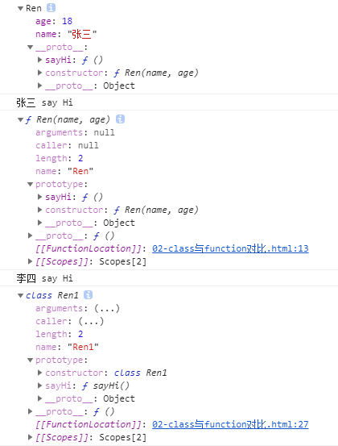
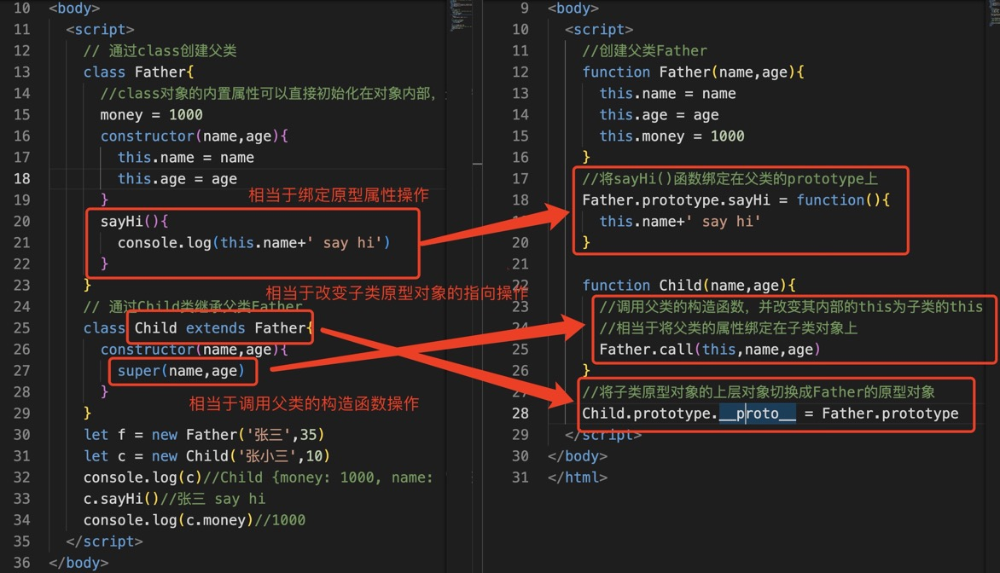
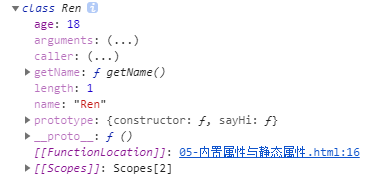

# 第二天 ECMAScript 6

## 今日内容

1. class 对象
2. set 对象
3. map 对象

## 1. class 对象

> ES6为了让函数的功能和使用场景专一化，提供了箭头函数来支持更单纯的函数功能。与此同时，为了让JavaScript更加符合面向对象语言的特性，ES6规范中增加了JavaScript语言对class的支持。class结构让面相对象编程，不再依赖function结构和复杂的prototype结构，从而产生更单纯的面向对象语法。


参考一个基本的class结构，代码如下：

```html
<!DOCTYPE html>
<html lang="en">

<head>
    <meta charset="UTF-8">
    <meta http-equiv="X-UA-Compatible" content="IE=edge">
    <meta name="viewport" content="width=device-width, initial-scale=1.0">
    <title>Document</title>
</head>

<body>
    <script>
        class Polygon {
            //构造函数
            constructor(height, width) {
                this.area = height * width;
            }
        }
        //实例化Polygon
        let p = new Polygon(4, 3)
        console.log(p.area);//12
    </script>
</body>

</html>
```

### 1.1 class 对象与 function 对象的区别 

class更单纯的实现了JavaScript面向对象的功能，且不需要使用繁琐的function语法进行面向对象的模拟。接下来参考下面的案例，了解class结构与function结构的简单对比，代码如下：

```html
<!DOCTYPE html>
<html lang="en">

<head>
    <meta charset="UTF-8">
    <meta http-equiv="X-UA-Compatible" content="IE=edge">
    <meta name="viewport" content="width=device-width, initial-scale=1.0">
    <title>Document</title>
</head>

<body>
    <script>
        function Ren(name, age) {
            this.name = name
            this.age = age
        }
        //这里使用function函数，否则内部的this永远是window
        Ren.prototype.sayHi = function () {
            console.log(this.name + ' say Hi')
        }
        let r = new Ren('张三', 18)
        console.log(r)//Ren {name: '张三', age: 18}
        r.sayHi() //张三 say Hi
        console.dir(Ren)//ƒ Ren(name,age)
        class Ren1 {
            //相当于function Ren(){}函数体本身
            constructor(name, age) {
                this.name = name
                this.age = age
            }
            //相当于function函数，该函数会自动绑定在Ren1的prototype上
            sayHi() {
                console.log(this.name + ' say Hi')
            }
        }
        let r1 = new Ren1('李四', 19)//Ren {name: '李四', age: 19}
        r1.sayHi()//李四 say Hi
        console.dir(Ren1)//class Ren1
    //Ren1()//该注释打开后会抛出异常：constructor Ren1 cannot be invoked without 'new'
    </script>
</body>

</html>
```

查看案例代码会发现，class结构与function函数结构完全不同，functino函数的prototype中的constructor()函数指向Ren()函数本身，所以实例化Ren对象时，相当于调用了Ren()函数并传入参数。而class对象创建的Ren1可以在内部显示声明constructor()函数，这样便可以直观的查看对象内部结构。在原型属性层面，functino函数所创建的对象，需要手动对对象的prototype绑定属性或方法，而class对象中除constructor()外的函数都会被自动绑定在该对象的prototype上。class作为单纯的面向对象功能实现，并不能被当作函数进行调用，在不使用new关键字执行该class的构造函数时会抛出异常信息：onstructor Ren1 cannot be invoked without 'new'。

class对象与function对象的本质区别，可以参考浏览器对两者的输出，如图1-1所示。



<center><b>图 1-1 浏览器对两者的输出的效果图</b></center>

class结构创建的对象，在控制台输出的结果中包含class标识字样，而function创建的对象在控制台中输出的结果中包含f标识，这便是ES6中对面向对象功能单一化的标识。除此之外，class对象与function对象的整体结构差异不大，都存在prototype对象，且对象上绑定的属性和方法，也都遵循原型链访问规则。

ES6推出了箭头函数与class对象的目的很明确，就是将过去全部交由function结构处理的函数与面向对象两部分彻底分离，使JavaScript编程语言在语法上更加健全，对跨语言编码的开发者也更加友好。

### 1.2 class 对象的继承

#### 1.2.1 构造函数原型继承

在JavaScript面向对象的章节中已经提到了继承的思路以及基本的继承实现，接下来回顾JavaScript中使用function对象实现的继承案例，代码如下：

```html
<!DOCTYPE html>
<html lang="en">

<head>
    <meta charset="UTF-8">
    <meta http-equiv="X-UA-Compatible" content="IE=edge">
    <meta name="viewport" content="width=device-width, initial-scale=1.0">
    <title>Document</title>
</head>

<body>
    <script>
        function Father(name, age) {
            this.name = name
            this.age = age
            this.money = 10000
        }
        Father.prototype.sayHi = function () {
            console.log(this.name + '说hi')
        }
        function Son(name, age) {
            this.name = name
            this.age = age
        }
        //自动继承函数
        Object.prototype.extend = function (Parent) {
            //保存子类对象默认属性名称的数组
            var argNameArr = []
            //按顺序保存子类默认属性名称所对应的值的数组
            var argValueArr = []
            //排除后绑定的extend属性并将子类自有属性的名称与对应的值分别放到两个数组中
            for (var key in this) {
                if (key != 'extend') {
                    argNameArr.push(key)
                    argValueArr.push(this[key])
                }
            }
            /*
                通过new Function生成该结构函数对象来动态控制参数的传递
                ƒ anonymous(name,age) {
                (function Father(name,age){
                        this.name = name
                        this.age = age
                        this.money = 10000
                    }).apply(this,arguments)
                }
            */
            var f = new Function(argNameArr, '(' + Parent.toString() + ').apply(this,arguments)')
            //调用父类的构造函数并传入子类的默认属性，最终将父类的自有属性绑定在子类的this上
            f.apply(this, argValueArr)
            //实例化后的子类的__proto__属性指向子类本身的prototype对象，则this.__proto__.__proto__代表将其原型链降级到父类之后
            this.__proto__.__proto__ = Parent.prototype
            //返回调整后的子类对象
            return this
        }
        var f = new Father('张三', 35)
        var s = new Son('张小三', 18).extend(Father)
        console.log(f)
        console.log(s)

    </script>
</body>

</html>
```

#### 1.2.2 class 对象继承

class 对象实现继承的方式与 JavaScript 的原始方式相比更加简洁，与其他面向对象语言的结构几乎一样，接下来通过一个基本的class对象实现继承的案例进行学习，代码如下：

```html
<!DOCTYPE html>
<html lang="en">

<head>
    <meta charset="UTF-8">
    <meta http-equiv="X-UA-Compatible" content="IE=edge">
    <meta name="viewport" content="width=device-width, initial-scale=1.0">
    <title>Document</title>
</head>

<body>
    <script>
        // 通过class创建父类
        class Father {
            //class对象的内置属性可以直接初始化在对象内部，无需声明符号
            money = 1000
            constructor(name, age) {
                this.name = name
                this.age = age
            }
            sayHi() {
                console.log(this.name + ' say hi')
            }
        }
        // 通过Child类继承父类Father
        class Child extends Father {
            constructor(name, age) {
                super(name, age)
            }
        }
        let f = new Father('张三', 35)
        let c = new Child('张小三', 10)
        console.log(c)//Child {money: 1000, name: '张小三', age: 18}
        c.sayHi()//张小三 say hi
        console.log(c.money)//1000
    </script>
</body>

</html>
```

查看案例代码会发现class对象的继承代码非常简洁，既不需要操作prototype，又不需要使用apply()来调用父类的构造函数，可以通过ES6与ES5的代码对比，来学习ES6的继承原理，如图1-2所示。



<center><b>图 1-2 ES6 与 ES5 的代码对比的效果图</b></center>

ES6的继承方式大大简化了ES5继承方式的编码操作，使代码耦合度降低，不再需要通过函数调用的方式实现继承，也无需操作prototype对象（大大降低了原型链污染）。这种继承方式，不光可以将可复用的属性与方法绑定在原型链上，还使得复杂的继承关系变得更加容易维护。

#### 1.2.3 super 关键字

`super` 这个关键字，既可以当作函数使用，也可以当作对象使用。在这两种情况下，它的用法完全不同。

第一种情况，`super` 作为函数调用时，代表父类的构造函数。ES6 要求，子类的构造函数必须执行一次`super()` 函数。

```javascript
class Father {}

class Son extends Father {
  constructor() {
    super();
  }
}
```

上面代码中，子类 `Son` 的构造函数之中的 `super()`，代表调用父类的构造函数。这是必须的，否则报错。

调用 `super()` 的作用是形成子类的 `this` 对象，把父类的实例属性和方法放到这个`this`对象上面。子类在调用 `super()` 之前，是没有 `this` 对象的，任何对 `this` 的操作都要放在 `super()` 的后面。

注意，这里的 `super` 虽然代表了父类的构造函数，但是因为返回的是子类的 `this`（即子类的实例对象），所以 `super` 内部的 `this` 代表子类的实例，而不是父类的实例，这里的 `super()` 相当于`A.prototype.constructor.call(this)`（在子类的 `this` 上运行父类的构造函数）。

```javascript
class Father {
  constructor() {
    console.log(new.target.name);
  }
}
class Son extends Father {
  constructor() {
    super();
  }
}
new Father() // Father
new Son() // Son
```

上面示例中，`new.target` 指向当前正在执行的函数。可以看到，在 `super()` 执行时（ `new Son()` ），它指向的是子类 `Son` 的构造函数，而不是父类 `Father` 的构造函数。也就是说，`super()` 内部的 `this` 指向的是 `B` 。

不过，由于 `super()` 在子类构造方法中执行时，子类的属性和方法还没有绑定到 `this`，所以如果存在同名属性，此时拿到的是父类的属性。

```javascript
class Father {
  name = 'Father';
  constructor() {
    console.log('My name is ' + this.name);
  }
}

class Son extends Father {
  name = 'Son';
}

const son = new Son(); // My name is A
```

上面示例中，最后一行输出的是`Father`，而不是`Son`，原因就在于 `super()` 执行时，`Son` 的 `name` 属性还没有绑定到 `this`，所以 `this.name` 拿到的是`Father`类的 `name` 属性。

作为函数时，`super()` 只能用在子类的构造函数之中，用在其他地方就会报错。

```javascript
class Father {}

class Son extends Father {
  m() {
    super(); // 报错
  }
}
```

上面代码中，`super()`用在`B`类的`m`方法之中，就会造成语法错误。

第二种情况，`super`作为对象时，在普通方法中，指向父类的原型对象；在静态方法中，指向父类。

```javascript
lass Father {
    say() {
        return 2;
    }
}

class Son extends Father {
    constructor() {
        super();
        console.log(super.say()); // 2
    }
}

let  = new Son();
```

上面代码中，子类`Son`当中的`super.say()`，就是将`super`当作一个对象使用。这时，`super`在普通方法之中，指向`A.prototype`，所以`super.say()`就相当于`A.prototype.say()`。

这里需要注意，由于`super`指向父类的原型对象，所以定义在父类实例上的方法或属性，是无法通过`super`调用的。

```javascript
class Father {
    constructor() {
        this.num = 2;
    }
}

class Son extends Father {
    get m() {
        return super.num;
    }
}

let s = new Son();
console.log(s.m); // undefined
```

上面代码中，`p`是父类`A`实例的属性，`super.p`就引用不到它。

### 1.3 属性、静态属性以及私有属性

#### 1.3.1 内置属性与静态属性

class对象中除最常用的内置属性外，还可以创建静态属性，静态属性的声明方式，代码如下：


```html
<!DOCTYPE html>
<html lang="en">

<head>
    <meta charset="UTF-8">
    <meta http-equiv="X-UA-Compatible" content="IE=edge">
    <meta name="viewport" content="width=device-width, initial-scale=1.0">
    <title>Document</title>
</head>

<body>
    <script>
        class Ren {
            static age = 18
            name = '张三'
            constructor(name) {
                if (name) {
                    this.name = name
                }
                console.log(this.age)//undefined
            }
            sayHi() {
                console.log(this.name + ' say hi')
            }
            static getName() {
                console.log(this.name)
            }
        }
        let r = new Ren('李四')
        console.log(r)//Ren {name: '李四'}
        console.log(this.getName) //undefined
        let r1 = new Ren()
        console.log(r1)//Ren {name: '张三'}

        console.dir(Ren)
    </script>
</body>

</html>
```

阅读案例代码后会发现，class对象内部可以使用static关键字进行属性或方法的修饰。被static关键字修饰的属性和方法为静态属性和静态方法，其具体说明如下：

1）静态属性：

静态属性与对象内置属性完全不同，它不可以被对象的实例访问，也无法在对象非静态函数中通过this对象访问。静态属性创建后直接被绑定在class对象本身，引用方式为：“类名.属性名”。

2）静态方法：

静态方法与对象内置方法完全不同，它不可以被对象的实例访问，也无法在对象非静态函数中通过this对象访问。静态方法创建后直接被绑定在class对象本身，引用方式为：“类名.函数名()”。

因此，在案例中使用this访问age属性时，会发现得到undefined结果，而实例化后的对象也无法访问getName()函数。静态属性与静态方法被直接绑定在实例化前的对象上，这种方式与原型对象类似，如图 1-3 所示。



<center><b>图 1-3 静态属性与静态方法被直接绑定在实例化前的对象上的效果图</b></center>

不同于原型对象，静态属性与静态方法无法被子类直接继承，且静态方法执行时的this永远指向class对象本身。继续改造上述案例，便可发现其特点，代码如下：

```html
<!DOCTYPE html>
<html lang="en">

<head>
    <meta charset="UTF-8">
    <meta http-equiv="X-UA-Compatible" content="IE=edge">
    <meta name="viewport" content="width=device-width, initial-scale=1.0">
    <title>Document</title>
</head>

<body>
    <script>
        class Ren {
            static age = 18
            name = '张三'
            constructor(name) {
                if (name) {
                    this.name = name
                }
                console.log(this.age)//undefined
            }
            sayHi() {
                console.log(this.name + ' say hi')
            }
            static getName() {
                console.log(this.name)
            }
        }
        let r = new Ren('李四')
        console.log(r)//Ren {name: '李四'}
        console.log(this.getName) //undefined
        let r1 = new Ren()
        console.log(r1)//Ren {name: '张三'}

        console.dir(Ren)
        //访问静态对象
        console.log(Ren.age)//18
        let name = Ren.getName()
        //getName函数为function函数，该函数执行时，调用者为Ren，所以getName中的this.name访问的实际上是Ren对象上自有的name属性
        console.log(name) //Ren
    </script>
</body>

</html>
```

由于class对象内置的函数都为function函数，所以函数内部的this对象随调用场景变化。调用Ren.getName()时，函数内的this对象会指向到Ren对象上，Ren对象内置的name属性是本类的名称Ren，所以并不会得到class对象内置属性name的结果。

静态属性和方法都会被绑定在class类本身，这种情况会使得静态属性与静态方法不会随对象的实例销毁，所以静态属性和方法通常用于，想要共享不同实例对象间的数据，且不希望该数据被子类继承时。这种情况下，静态属性和方法就会发挥其用武之地。

#### 1.3.2 内置属性与私有属性

class对象内还具备一种特殊的属性和方法，即私有属性与私有方法。私有的意图很明确，即在对象内部创建，仅归对象所有，其他人无权访问。私有属性与私有方法的基本使用案例，代码如下：

```html
<!DOCTYPE html>
<html lang="en">

<head>
    <meta charset="UTF-8">
    <meta http-equiv="X-UA-Compatible" content="IE=edge">
    <meta name="viewport" content="width=device-width, initial-scale=1.0">
    <title>Document</title>
</head>

<body>
    <script>
        class Ren {
            #name = '张三'
            #age = 18
            constructor() {
                console.log(this.#name)//张三
                console.log(this.#age)//18
            }
            #sayHi() {
                console.log('hi')
            }
        }
        let r = new Ren()
        console.log(r)//{#sayHi: ƒ, #name: '张三', #age: 18}
        // console.log(r.#name)//Error:Private field '#name' must be declared in an enclosing class
        console.log(r['#name'])//undefined
    //r.#sayHi()//Error:Private field '#sayHi' must be declared in an enclosing class
    </script>
</body>

</html>
```

虽然私有属性与私有方法在对象中是可见的，但实例化后，无法被实例对象访问，若强制使用会抛出异常信息：“Private field '#name' must be declared in an enclosing class”。私有属性可以在对象作用域内部被访问，所以私有属性通常被用于保护对象内部的数据不受外部污染。某些情况下，需要记录对象内部某个函数的精确调用次数，私有属性的意义便显得很重大，参考下面的案例，代码如下：

```html
<!DOCTYPE html>
<html lang="en">

<head>
    <meta charset="UTF-8">
    <meta http-equiv="X-UA-Compatible" content="IE=edge">
    <meta name="viewport" content="width=device-width, initial-scale=1.0">
    <title>Document</title>
</head>

<body>
    <script>
        class Ren {
            count = 0
            #count = 0
            constructor() {
            }
            sayHi() {
                console.log('say hi')
                // 记录sayHi()的调用次数
                this.count++
                this.#count++
            }
            getCount() {
                return this.#count
            }
        }
        let r = new Ren()
        r.sayHi()
        r.sayHi()
        console.log(r.count)//2
        r.count = 100
        // r.#count = 100 //无法直接对#count进行赋值操作
        r.sayHi()
        console.log(r.count)//101
        let count = r.getCount()
        console.log(count)//3
    </script>
</body>

</html>
```

参考案例代码，若需要记录class对象内部某个函数的调用次数，开发者最担心的便是该记录被篡改，此案例中分别使用count和#count两种属性记录sayHi()函数的调用次数。在对象实例化后，count属性可以实现对sayHi()函数调用次数的记录和获取，危险的是，一旦外部对count属性本身做了修改，该属性记录的执行测试便不能作为可信数据。此时，私有属性#count的应用场景便出现了。私有属性#count只有在class对象内部才能被访问，所以能持续记录执行次数。通过getCount()函数将#count进行return操作，实例对象也可以在class外部访问#count的结果，这种方式记录sayHi()函数的执行次数便更加安全，因为#count无法直接被外部赋值，唯一能在class外部访问且能改变#count结果的便是sayHi()函数，这样的结构使得#count记录的数据是安全且精确的。

私有属性还可以配合class中的setter与getter一起使用，代码如下：

```html
<!DOCTYPE html>
<html lang="en">

<head>
    <meta charset="UTF-8">
    <meta http-equiv="X-UA-Compatible" content="IE=edge">
    <meta name="viewport" content="width=device-width, initial-scale=1.0">
    <title>Document</title>
</head>

<body>
    <script>
        class Ren {
            #count = 0
            constructor() {
            }
            set count(c) {
                console.log('对count设置新的值')
                this.#count = c
            }
            get count() {
                console.log('获取count的值')
                return this.#count
            }
        }
        let r = new Ren()
        console.log(r.count)//0
        r.count++
        r.count++
        console.log(r.count)//2
        console.log(r)//Ren {#count: 2}
    </script>
</body>

</html>
```

class对象中的setter和getter的本质是Object.defineProperty()定义的setter和getter，所以案例中的count虽然可以作为变量使用，但其本身只具备赋值取值的状态追踪。私有属性特别适合配合setter和getter使用，它可以存储setter与getter的结果，且不会将存储的数据显示公开到对象外，所以私有属性在该场景天然试用。

## 2. Set与Map

### 2.1 Set 对象

> Set 对象允许存储任何类型的唯一值，无论是原始值或者是对象引用。Set对象是值的集合，可以按照插入的顺序迭代它的元素。Set 中的元素只会出现一次，即 Set 中的元素是唯一的。

因为 Set 中的值总是唯一的，所以需要判断两个值是否相等。在 ECMAScript 规范的早期版本中，这不是基于和 `===` 操作符中使用的算法相同的算法。具体来说，对于 Set，+0（+0 严格相等于 -0）和 -0 是不同的值。然而，在 ECMAScript 2015 规范中这点已被更改。另外，NaN 和 undefined 都可以被存储在 Set 中，NaN 之间被视为相同的值（NaN 被认为是相同的，尽管 NaN !== NaN）。


#### 2.1.1 Set 对象原型方法

（1）`Set.prototype.add(value)`：在Set对象尾部添加一个元素。返回该 Set 对象。

（2）`Set.prototype.clear()`：移除Set对象内的所有元素。

（3）`Set.prototype.delete(value)`：移除值为 value 的元素，并返回一个布尔值来表示是否移除成功。Set.prototype.has(value) 会在此之后返回 false。

（4）`Set.prototype.entries()`：返回一个新的迭代器对象，该对象包含 Set 对象中的按插入顺序排列的所有元素的值的 [value, value] 数组。为了使这个方法和 Map 对象保持相似，每个值的键和值相等。

（5）`Set.prototype.forEach(callbackFn[, thisArg])`：按照插入顺序，为 Set 对象中的每一个值调用一次 callBackFn。如果提供了thisArg参数，回调中的 this 会是这个参数。

（6）`Set.prototype.has(value)`：返回一个布尔值，表示该值在 Set 中存在与否。

（7）`Set.prototype.keys()`：与 values() 方法相同，返回一个新的迭代器对象，该对象包含 Set 对象中的按插入顺序排列的所有元素的值。

（8）`Set.prototype.values()`：返回一个新的迭代器对象，该对象包含 Set 对象中的按插入顺序排列的所有元素的值。

（9）`Set.prototype[@@iterator]()`：返回一个新的迭代器对象，该对象包含 Set 对象中的按插入顺序排列的所有元素的值。

接下来参考如下案例，学习Set对象的基本操作方法，代码如下：

```javascript
let mySet = new Set();

mySet.add(1); // Set [ 1 ]
mySet.add(5); // Set [ 1, 5 ]
mySet.add(5); // Set [ 1, 5 ]
mySet.add("some text"); // Set [ 1, 5, "some text" ]
let o = {a: 1, b: 2};
mySet.add(o);

mySet.add({a: 1, b: 2}); // o 指向的是不同的对象，所以没问题

mySet.has(1); // true
mySet.has(3); // false
mySet.has(5);              // true
mySet.has(Math.sqrt(25));  // true
mySet.has("Some Text".toLowerCase()); // true
mySet.has(o); // true

mySet.size; // 5

mySet.delete(5);  // true，从 set 中移除 5
mySet.has(5);     // false, 5 已经被移除

mySet.size; // 4，刚刚移除一个值

console.log(mySet);
// logs Set(4) [ 1, "some text", {…}, {…} ] in Firefox
// logs Set(4) { 1, "some text", {…}, {…} } in Chrome
```

2.2 Set 对象

#### 2.1.2 Set  对象迭代

Set 对象虽然与数组不同，但可以通过多种方式遍历Set对象，代码如下：

```javascript
// 迭代整个 set
// 按顺序输出：1, "some text", {"a": 1, "b": 2}, {"a": 1, "b": 2}
for (let item of mySet) console.log(item);

// 按顺序输出：1, "some text", {"a": 1, "b": 2}, {"a": 1, "b": 2}
for (let item of mySet.keys()) console.log(item);

// 按顺序输出：1, "some text", {"a": 1, "b": 2}, {"a": 1, "b": 2}
for (let item of mySet.values()) console.log(item);

// 按顺序输出：1, "some text", {"a": 1, "b": 2}, {"a": 1, "b": 2}
//(键与值相等)
for (let [key, value] of mySet.entries()) console.log(key);

// 使用 Array.from 转换 Set 为 Array
var myArr = Array.from(mySet); // [1, "some text", {"a": 1, "b": 2}, {"a": 1, "b": 2}]

// 如果在 HTML 文档中工作，也可以：
mySet.add(document.body);
mySet.has(document.querySelector("body")); // true

// Set 和 Array 互换
mySet2 = new Set([1, 2, 3, 4]);
mySet2.size;               // 4
[...mySet2];               // [1,2,3,4]

var set1 = new Set([1, 2, 3, 4, 5]);
var set2 = new Set([3, 4, 5, 6, 7]);
// 可以通过如下代码模拟求交集
let intersection = new Set([...set1].filter(x => set2.has(x)));

// 可以通过如下代码模拟求差集
let difference = new Set([...set1].filter(x => !set2.has(x)));

// 用 forEach 迭代
mySet.forEach(function(value) {
  console.log(value);
});

// 1
// 2
// 3
// 4
```

#### 2.1.3 Set 对象操作

可以通过JavaScript基础代码，实现对多个Set集合的合并、去重以及比较等操作，代码如下：

```javascript
function isSuperset(set, subset) {
    for (let elem of subset) {
        if (!set.has(elem)) {
            return false;
        }
    }
    return true;
}

function union(setA, setB) {
    let _union = new Set(setA);
    for (let elem of setB) {
        _union.add(elem);
    }
    return _union;
}

function intersection(setA, setB) {
    let _intersection = new Set();
    for (let elem of setB) {
        if (setA.has(elem)) {
            _intersection.add(elem);
        }
    }
    return _intersection;
}

function symmetricDifference(setA, setB) {
    let _difference = new Set(setA);
    for (let elem of setB) {
        if (_difference.has(elem)) {
            _difference.delete(elem);
        } else {
            _difference.add(elem);
        }
    }
    return _difference;
}

function difference(setA, setB) {
    let _difference = new Set(setA);
    for (let elem of setB) {
        _difference.delete(elem);
    }
    return _difference;
}

//Examples
let setA = new Set([1, 2, 3, 4]),
    setB = new Set([2, 3]),
    setC = new Set([3, 4, 5, 6]);

isSuperset(setA, setB);          // => true
union(setA, setC);               // => Set [1, 2, 3, 4, 5, 6]
intersection(setA, setC);        // => Set [3, 4]
symmetricDifference(setA, setC); // => Set [1, 2, 5, 6]
difference(setA, setC);          // => Set [1, 2]
```

#### 2.1.4 Set 对象转换

Set 对象可以与数组进行相互转换，代码如下：

```javascript
let myArray = ["value1", "value2", "value3"];

// 用 Set 构造器将 Array 转换为 Set
let mySet = new Set(myArray);

mySet.has("value1"); // returns true

// 用...(展开操作符) 操作符将 Set 转换为 Array
console.log([...mySet]); // 与 myArray 完全一致
```


### 2.2 Map 对象

> Map 对象保存键值对，并且能够记住键的原始插入顺序。任何值（对象或者基本类型）都可以作为一个键或一个值。
>
> Map 对象是键值对的集合。Map 中的一个键只能出现一次；它在 Map 的集合中是独一无二的。Map 对象按键值对迭代——一个 for...of 循环在每次迭代后会返回一个形式为 [key，value] 的数组。迭代按插入顺序进行，即键值对按 set() 方法首次插入到集合中的顺序（也就是说，当调用 set() 时，map 中没有具有相同值的键）进行迭代。

规范要求 map 实现“平均访问时间与集合中的元素数量呈次线性关系”。因此，它可以在内部表示为哈希表（使用 O(1) 查找）、搜索树（使用 O(log(N)) 查找）或任何其他数据结构，只要复杂度小于 O(N)。

键的比较基于零值相等算法（它曾经使用同值相等，将 0 和 -0 视为不同。检查浏览器兼容性。），这意味着 NaN 是与 NaN 相等的（虽然 NaN !== NaN），剩下所有其它的值是根据 `===` 运算符的结果判断是否相等。

设置对象属性同样适用于 Map 对象，但容易造成困扰。即，以下的代码能够正常运行（但不推荐），代码如下：

```javascript
const wrongMap = new Map();
wrongMap['bla'] = 'blaa';
wrongMap['bla2'] = 'blaaa2';

console.log(wrongMap); // Map { bla: 'blaa', bla2: 'blaaa2' }
```

但这种设置属性的方式不会改变 Map 的数据结构。它使用的是通用对象的特性。'bla' 的值未被存储在 Map 中，无法被查询到。其它的对这一数据的操作也会失败，代码如下：

```javascript
wrongMap.has('bla')    // false
wrongMap.delete('bla') // false
console.log(wrongMap)  // Map { bla: 'blaa', bla2: 'blaaa2' }
```

正确的存储数据到 Map 中的方式是使用 set(key, value) 方法，代码如下：

```javascript
const contacts = new Map()
contacts.set('Jessie', {phone: "213-555-1234", address: "123 N 1st Ave"})
contacts.has('Jessie') // true
contacts.get('Hilary') // undefined
contacts.set('Hilary', {phone: "617-555-4321", address: "321 S 2nd St"})
contacts.get('Jessie') // {phone: "213-555-1234", address: "123 N 1st Ave"}
contacts.delete('Raymond') // false
contacts.delete('Jessie') // true
console.log(contacts.size) // 1
```

#### 2.2.1 Map 对象原型方法

（1）`Map.prototype.clear()`：移除 Map 对象中所有的键值对。

（2）`Map.prototype.delete()`：移除 Map 对象中指定的键值对，如果键值对存在并成功被移除，返回 true，否则返回 false。调用 delete 后再调用 map.has(key) 将返回 false。

（3）`Map.prototype.get()`：返回与指定的键 key 关联的值，若不存在关联的值，则返回 undefined。

（4）`Map.prototype.has()`：返回一个布尔值，用来表明 Map 对象中是否存在与指定的键 key 关联的值。

（5）`Map.prototype.set()`：在 Map 对象中设置与指定的键 key 关联的值，并返回 Map 对象。

（6）`Map.prototype[@@iterator]()`：返回一个新的迭代对象，其为一个包含 Map 对象中所有键值对的 [key, value] 数组，并以插入 Map 对象的顺序排列。

（7）`Map.prototype.keys()`：返回一个新的迭代对象，其中包含 Map 对象中所有的键，并以插入 Map 对象的顺序排列。

（8）`Map.prototype.values()`：返回一个新的迭代对象，其中包含 Map 对象中所有的值，并以插入 Map 对象的顺序排列。

（9）`Map.prototype.entries()`：返回一个新的迭代对象，其为一个包含 Map 对象中所有键值对的 [key, value] 数组，并以插入 Map 对象的顺序排列。

（10）`Map.prototype.forEach()`：以插入的顺序对 Map 对象中存在的键值对分别调用一次 callbackFn。如果给定了 thisArg 参数，这个参数将会是回调函数中 this 的值。

#### 2.2.2 Map 对象的基本使用

Map对象的基本使用方式，代码如下：

```javascript
const myMap = new Map();

const keyString = 'a string';
const keyObj = {};
const keyFunc = function() {};

// 添加键
myMap.set(keyString, "和键'a string'关联的值");
myMap.set(keyObj, "和键 keyObj 关联的值");
myMap.set(keyFunc, "和键 keyFunc 关联的值");

console.log(myMap.size); // 3

// 读取值
console.log(myMap.get(keyString)); // "和键'a string'关联的值"
console.log(myMap.get(keyObj)); // "和键 keyObj 关联的值"
console.log(myMap.get(keyFunc)); // "和键 keyFunc 关联的值"

console.log(myMap.get('a string')); // "和键'a string'关联的值"，因为 keyString === 'a string'
console.log(myMap.get({})); // undefined，因为 keyObj !== {}
console.log(myMap.get(function() {})); // undefined，因为 keyFunc !== function () {}

```

NaN 也可以作为 Map 对象的键。虽然 NaN 与任何值甚至与自己都不相等（NaN !== NaN 返回 true），但是因为所有的 NaN 的值都是无法区分的，所以下面的例子成立，代码如下：

```javascript
const myMap = new Map();
myMap.set(NaN, 'not a number');

myMap.get(NaN);
// "not a number"

const otherNaN = Number('foo');
myMap.get(otherNaN);
// "not a number"
```

#### 2.2.3 Map 对象迭代

Map 可以使用 for...of 循环来实现迭代，代码如下：

```javascript
const myMap = new Map();
myMap.set(0, 'zero');
myMap.set(1, 'one');

for (const [key, value] of myMap) {
  console.log(`${key} = ${value}`);
}
// 0 = zero
// 1 = one

for (const key of myMap.keys()) {
  console.log(key);
}
// 0
// 1

for (const value of myMap.values()) {
  console.log(value);
}
// zero
// one

for (const [key, value] of myMap.entries()) {
  console.log(`${key} = ${value}`);
}
// 0 = zero
// 1 = one
```

Map 对象通过 forEach() 方法迭代，代码如下：

```javascript
myMap.forEach((value, key) => {
  console.log(`${key} = ${value}`);
});
// 0 = zero
// 1 = one
```

#### 2.2.4 Map 对象转换

与Set集合相同，Map也可以与数组之间做类型转换，代码如下：

```javascript
const kvArray = [['key1', 'value1'], ['key2', 'value2']];

// 使用常规的 Map 构造函数可以将一个二维键值对数组转换成一个 Map 对象
const myMap = new Map(kvArray);

console.log(myMap.get('key1')); // "value1"

// 使用 Array.from 函数可以将一个 Map 对象转换成一个二维键值对数组
console.log(Array.from(myMap)); // 输出和 kvArray 相同的数组

// 更简洁的方法来做如上同样的事情，使用展开运算符
console.log([...myMap]);

// 或者在键或者值的迭代器上使用 Array.from，进而得到只含有键或者值的数组
console.log(Array.from(myMap.keys())); // 输出 ["key1", "key2"]
```

#### 2.2.5 Map 对象操作

作为对象类型的数据结构，Map 能像数组一样被复制，代码如下：

```javascript
const original = new Map([
  [1, 'one'],
]);

const clone = new Map(original);

console.log(clone.get(1)); // one
console.log(original === clone); // false. 浅比较 不为同一个对象的引用
```

Map 对象间可以进行合并，但是会保持键的唯一性，代码如下：

```javascript
const first = new Map([
  [1, 'one'],
  [2, 'two'],
  [3, 'three'],
]);

const second = new Map([
  [1, 'uno'],
  [2, 'dos']
]);

// 合并两个 Map 对象时，如果有重复的键值，则后面的会覆盖前面的。
// 展开语法本质上是将 Map 对象转换成数组。
const merged = new Map([...first, ...second]);

console.log(merged.get(1)); // uno
console.log(merged.get(2)); // dos
console.log(merged.get(3)); // three
```

最后，Map 对象也能与数组合并，代码如下：

```javascript
const first = new Map([
  [1, 'one'],
  [2, 'two'],
  [3, 'three'],
]);

const second = new Map([
  [1, 'uno'],
  [2, 'dos']
]);

// Map 对象同数组进行合并时，如果有重复的键值，则后面的会覆盖前面的。
const merged = new Map([...first, ...second, [1, 'eins']]);

console.log(merged.get(1)); // eins
console.log(merged.get(2)); // dos
console.log(merged.get(3)); // three
```

